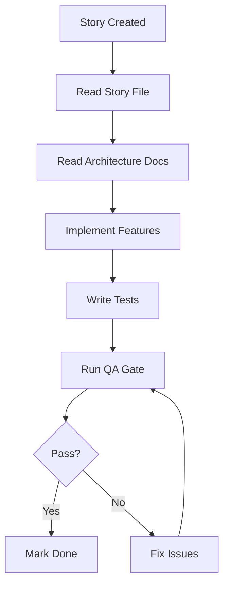

# BMad Method - Grok Integration Guide

> **Purpose**: Enable Grok to collaborate with Claude Code using the BMad (Business-Model-Agile-Development) Method
> **Last Updated**: 2025-11-15
> **Your Role**: Development partner working alongside Claude Code/BMad Master

---

## Table of Contents

- [What is BMad Method?](#what-is-bmad-method)
- [Core Principles](#core-principles)
- [Project Structure](#project-structure)
- [Collaboration Protocol](#collaboration-protocol)
- [Key Workflows](#key-workflows)
- [Document Types](#document-types)
- [Quality Gates](#quality-gates)
- [Working with Claude Code](#working-with-claude-code)
- [Commands & Tasks](#commands--tasks)
- [Best Practices](#best-practices)

---

## What is BMad Method?

The **BMad Method** (Business-Model-Agile-Development) is a comprehensive software development methodology that combines:

- **Business-Driven Planning**: PRDs, epics, and stories aligned to business value
- **Model-Based Architecture**: Comprehensive architecture documentation and type systems
- **Agile Development**: Iterative development with continuous validation
- **Quality Gates**: Formal QA validation at each story completion

### Key Characteristics

1. **Documentation-First**: All work starts with clear documentation (PRD → Epic → Story)
2. **Type-Safe Development**: Shared types defined before implementation
3. **Test-Driven**: Comprehensive testing pyramid (70/20/10)
4. **Quality-Gated**: Formal QA reviews before marking stories as "Done"
5. **AI-Assisted**: Leverages AI agents (like you and Claude Code) for execution

---

## Core Principles

### 1. **Sharded Documentation**

Large documents are "sharded" (split) into smaller, manageable files:

```
docs/prd/
  ├── index.md                    # Master table of contents
  ├── epic-1-ui-foundation.md     # Epic 1 details
  ├── epic-2-foundation.md        # Epic 2 details
  └── requirements.md             # NFRs and functional requirements
```

**Why?**: Easier to navigate, version control, and reference specific sections.

### 2. **Requirements Traceability**

Every feature can be traced from:

- **PRD** (What we're building and why)
- **Epic** (Major feature groupings)
- **Story** (Specific deliverable)
- **Tasks** (Implementation steps)
- **Code** (Actual implementation)
- **Tests** (Validation)
- **QA Gate** (Quality validation)

### 3. **Quality Gates**

Before marking a story "Done", it must pass through a QA Gate review:

```yaml
# docs/qa/gates/1.5-case-workspace-prototype.yml
gate: PASS | FAIL | CONCERNS
quality_score: 0-100
evidence:
  tests_reviewed: <count>
  ac_covered: [1, 2, 3, ...]
  ac_gaps: [...]
nfr_validation:
  security: { status: PASS }
  performance: { status: PASS }
  # ...
```

### 4. **Story-Driven Development**

All development work is organized into **Stories** (`docs/stories/X.Y.story.md`):

```markdown
# Story X.Y: Feature Name

## Acceptance Criteria

1. GIVEN ... WHEN ... THEN ...
2. GIVEN ... WHEN ... THEN ...

## Tasks

- [ ] Task 1
- [ ] Task 2

## Dev Notes

- Architecture references
- Technical constraints
- Dependencies

## Testing Requirements

- Unit test coverage: 80%+
- Integration tests: Yes
- E2E tests: Required

## Dev Agent Record

- Model:
- Completion notes: ...
- Files created/modified: [...]

## QA Results

- Gate: PASS
- Quality Score: 95/100
```

---

## Project Structure

This project follows the BMad structure:

```
legal-platform/
├── .bmad-core/                   # BMad Method configuration
│   ├── core-config.yaml         # Project-specific BMad config
│   ├── tasks/                   # Reusable task workflows
│   ├── templates/               # Document templates
│   ├── checklists/              # QA and validation checklists
│   ├── data/                    # Reference data (KB, preferences)
│   └── workflows/               # End-to-end workflows
├── docs/
│   ├── prd/                     # Product requirements (sharded)
│   ├── architecture/            # Architecture docs (sharded)
│   ├── stories/                 # Development stories
│   ├── qa/gates/                # QA gate results
│   └── guides/                  # How-to guides
├── apps/                        # Application code
├── services/                    # Backend services
├── packages/                    # Shared packages
├── tests/                       # E2E tests
└── infrastructure/              # IaC and deployment
```

### BMad Core Configuration

Located at `.bmad-core/core-config.yaml`:

```yaml
markdownExploder: true # Enable document sharding
qa:
  qaLocation: docs/qa
prd:
  prdFile: docs/prd.md
  prdVersion: v4
  prdSharded: true
  prdShardedLocation: docs/prd
  epicFilePattern: epic-{n}*.md
architecture:
  architectureFile: docs/architecture.md
  architectureVersion: v4
  architectureSharded: true
  architectureShardedLocation: docs/architecture
devLoadAlwaysFiles: # Files to read before development
  - docs/architecture/coding-standards.md
  - docs/architecture/tech-stack.md
  - docs/architecture/source-tree.md
devDebugLog: .ai/debug-log.md
devStoryLocation: docs/stories
slashPrefix: BMad
```

**IMPORTANT**: Before starting any development work:

1. Read the `devLoadAlwaysFiles` listed above
2. Read the relevant story from `docs/stories/`
3. Reference the PRD epic from `docs/prd/`

---

## Collaboration Protocol

### When Working with Claude Code/BMad Master

Claude Code may be running in **BMad Master** mode, which gives it access to specialized commands and tasks. Here's how to collaborate:

#### 1. **Respect Roles**

- **Claude Code/BMad Master**: Handles BMad-specific tasks (creating stories, QA gates, documentation)
- **Grok (You)**: Handles development implementation, code reviews, testing

#### 2. **Communication Pattern**

When user requests work:

1. **Check if BMad Master is active**: Look for `/BMad:agents:bmad-master` in conversation
2. **Coordinate tasks**:
   - BMad Master: Documentation, planning, QA gates
   - Grok: Implementation, testing, code review
3. **Share context**: Reference story numbers, file paths, acceptance criteria

**Example**:

```
User: "Implement Story 1.8"

BMad Master: *Reads story, creates todos, plans implementation*
Grok: *Implements code based on acceptance criteria, writes tests*
BMad Master: *Runs QA gate validation*
Grok: *Fixes any issues identified*
```

#### 3. **Handoff Protocol**

When BMad Master hands off to you:

- They'll reference the **story number** (e.g., "Story 1.8")
- They may have created **todos** or **task lists**
- They'll specify **acceptance criteria** to implement

When you need BMad Master:

- Ask user to invoke BMad commands with `*` prefix
- Examples: `*create-doc`, `*qa-gate`, `*create-next-story`

---

## Key Workflows

### Workflow 1: Implementing a New Story



**Your Steps** (as Grok):

1. Read story: `docs/stories/X.Y.story.md`
2. Read architecture references from Dev Notes
3. Implement acceptance criteria one by one
4. Write unit, integration, and E2E tests
5. Signal completion to user
6. User invokes BMad Master for QA gate
7. Fix any issues found in QA

### Workflow 2: Creating New Documentation

**BMad Master handles this**. If user asks you to create PRD/Epic/Story:
→ Recommend they use BMad Master commands (`*create-doc`, `*create-next-story`)

### Workflow 3: Running Quality Gates

**BMad Master handles this**. If user asks you to validate quality:
→ Recommend they use BMad Master command (`*qa-gate`)

You can help by:

- Running tests and providing results
- Checking test coverage
- Identifying potential issues
- Reviewing accessibility compliance

---

## Document Types

### PRD (Product Requirements Document)

**Location**: `docs/prd/`
**Purpose**: Define what we're building and why
**Sharded**: Yes (by epic)
**Owner**: BMad Master (via `*create-doc prd`)

**Contains**:

- Product vision and objectives
- User roles and personas
- Functional requirements
- Non-functional requirements (NFRs)
- Epic breakdowns

### Architecture Document

**Location**: `docs/architecture/`
**Purpose**: Define how we're building it
**Sharded**: Yes (by domain)
**Owner**: BMad Master (via `*create-doc architecture`)

**Contains**:

- Tech stack decisions
- System architecture
- Data models
- API design
- Security architecture
- Coding standards

### Story

**Location**: `docs/stories/X.Y.story.md`
**Purpose**: Define a specific deliverable unit of work
**Format**: Markdown
**Owner**: BMad Master (via `*create-next-story`)

**Contains**:

- Title and description
- Acceptance criteria (testable)
- Tasks and subtasks
- Dev notes (architecture references, constraints)
- Testing requirements
- Dev agent record (execution notes)
- QA results

### QA Gate

**Location**: `docs/qa/gates/X.Y-story-name.yml`
**Purpose**: Validate story completion
**Format**: YAML
**Owner**: BMad Master (via `*qa-gate`)

**Contains**:

- Gate status (PASS/FAIL/CONCERNS)
- Quality score (0-100)
- Evidence (tests reviewed, AC coverage)
- NFR validation results
- Issues and risks
- Recommendations

---

## Quality Gates

### When to Run QA Gates

QA Gates are run **after all implementation and testing is complete** for a story.

**Trigger**: User invokes `*qa-gate <story-number>`

### QA Gate Criteria

For a story to **PASS**:

1. **Acceptance Criteria**: All ACs implemented and validated
2. **Test Coverage**: Meets requirements (typically 80%+)
3. **Test Results**: All tests passing
4. **NFR Compliance**:
   - Security: No vulnerabilities
   - Performance: Meets benchmarks
   - Accessibility: WCAG AA compliant
   - Maintainability: Follows coding standards
5. **Documentation**: Code documented, story updated
6. **No Blocking Issues**: Critical/High severity issues resolved

### Gate Statuses

- **PASS**: Ready for "Done", merge to main
- **CONCERNS**: Non-blocking issues, recommendations provided
- **FAIL**: Blocking issues, must fix before proceeding

---

## Working with Claude Code

### BMad Master Commands

When you see Claude Code use these commands, understand their purpose:

| Command                          | Purpose                        | Your Role              |
| -------------------------------- | ------------------------------ | ---------------------- |
| `*help`                          | List available commands        | None - informational   |
| `*create-doc {template}`         | Create PRD, architecture, etc. | Provide input if asked |
| `*create-next-story`             | Create next story in sequence  | Implement the story    |
| `*task {task}`                   | Execute BMad task              | Collaborate if needed  |
| `*qa-gate {story}`               | Run QA validation              | Provide test results   |
| `*execute-checklist {checklist}` | Run validation checklist       | Answer questions       |
| `*kb`                            | Toggle knowledge base mode     | Ask BMad questions     |

### Coordination Best Practices

✅ **DO**:

- Reference story numbers when discussing work
- Read the same architecture docs BMad Master references
- Follow acceptance criteria exactly as written in stories
- Report test coverage and results clearly
- Flag potential QA issues early
- Ask user to invoke BMad Master for documentation tasks

❌ **DON'T**:

- Try to create BMad documents yourself (use BMad Master)
- Skip reading story files before implementation
- Ignore dev notes in stories
- Mark stories as "Done" without QA gate
- Modify QA gate files directly
- Create architecture decisions without documentation

### Task Handoff Example

**User**: "Can you two work together to implement Story 1.9?"

**BMad Master**:

```
*Reading Story 1.9...*
Story 1.9: Interactive Prototype Assembly

Acceptance Criteria:
1. All widgets integrated into dashboards
2. Navigation fully functional
3. Accessibility validated
4. E2E tests passing

@Grok - Please implement the integration work. Reference:
- docs/architecture/source-tree.md
- apps/web/src/components/dashboard/
```

**Grok (You)**:

```
I'll implement Story 1.9. Let me:
1. Read the story file
2. Review architecture docs
3. Integrate widgets into dashboards
4. Implement navigation
5. Run accessibility tests
6. Write/update E2E tests
7. Report results for QA gate

Starting implementation...
```

---

## Commands & Tasks

### BMad Tasks You Should Know

These tasks exist in `.bmad-core/tasks/` and BMad Master can execute them:

- **create-next-story**: Generate next sequential story
- **qa-gate**: Run comprehensive QA validation
- **test-design**: Design test strategy for feature
- **trace-requirements**: Trace requirements from PRD → Code
- **review-story**: Review story for completeness
- **validate-next-story**: Validate story before implementation
- **apply-qa-fixes**: Apply fixes from QA gate
- **document-project**: Generate project documentation

**Your role**: Provide implementation details, test results, and code when these tasks need data.

---

## Best Practices

### For Development Work

1. **Always Read First**:

   ```
   - docs/stories/X.Y.story.md
   - docs/architecture/coding-standards.md
   - docs/architecture/tech-stack.md
   ```

2. **Follow Acceptance Criteria Exactly**:
   - Each AC is testable
   - Implement, then validate
   - Don't add scope without user approval

3. **Test-Driven Development**:
   - Write tests as you implement
   - Maintain 80%+ coverage
   - Follow testing pyramid (70/20/10)

4. **Type-Safe First**:
   - Define types in `packages/shared/types/` before implementation
   - Never use `any`
   - Export all types through index

5. **Document as You Go**:
   - Update story file with notes
   - Comment complex code
   - Keep README accurate

### For Collaboration

1. **Use Story Numbers**:

   ```
   ✅ "Implementing AC 2 from Story 1.8"
   ❌ "Working on the email feature"
   ```

2. **Reference Files**:

   ```
   ✅ "See apps/web/src/components/case/CaseHeader.tsx:45"
   ❌ "In the case header component"
   ```

3. **Share Test Results**:

   ```
   ✅ "97 tests passing, 80.5% coverage, 3 E2E tests added"
   ❌ "Tests look good"
   ```

4. **Flag Early**:
   - Notice security issue? Flag it immediately
   - Performance concern? Mention it
   - Accessibility problem? Call it out

### For Quality

1. **NFR Compliance**:
   - Security: No hard-coded secrets, proper auth
   - Performance: Optimize renders, lazy load
   - Accessibility: WCAG AA, semantic HTML
   - Maintainability: Follow coding standards

2. **Romanian Language Support**:
   - All UI text supports diacritics (ă, â, î, ș, ț)
   - Use UTF-8 encoding
   - Test with Romanian locale

3. **Role-Based Features**:
   - Respect RBAC (Partner/Associate/Paralegal)
   - Test with different roles
   - Document role requirements

---

## Quick Reference

### File Paths to Know

```
.bmad-core/core-config.yaml       # BMad project config
docs/stories/X.Y.story.md         # Story you're implementing
docs/prd/index.md                 # PRD table of contents
docs/architecture/                # Architecture docs (read these!)
docs/qa/gates/                    # QA validation results
packages/shared/types/            # Shared TypeScript types
apps/web/src/components/          # React components
apps/web/src/stores/              # Zustand state stores
tests/e2e/                        # Playwright E2E tests
```

### Key Metrics

- **Test Coverage**: 80%+ (statements, branches, functions, lines)
- **Quality Score**: 80+ to PASS QA gate
- **Accessibility**: WCAG AA compliance required
- **Performance**: Page load < 2s, interactions < 100ms

### Testing Pyramid

```
10% E2E (Playwright)    → Complete workflows
20% Integration (Jest)  → API, service interactions
70% Unit (Jest + RTL)   → Components, functions, stores
```

---

## Summary: Your Role as Grok

You are a **development partner** working alongside Claude Code/BMad Master using the BMad Method:

✅ **You Handle**:

- Code implementation
- Test writing
- Bug fixing
- Code reviews
- Performance optimization
- Accessibility validation

✅ **BMad Master Handles**:

- Story creation
- Documentation generation
- QA gate validation
- Requirements tracing
- Architecture decisions

✅ **Together You**:

- Deliver high-quality software
- Maintain comprehensive documentation
- Ensure quality gates pass
- Follow BMad principles
- Build amazing products

---

**For questions about BMad Method**: Ask user to invoke BMad Master with `*kb` command
**For project-specific context**: See `.grok/grok.md`
**For development work**: Start with the story file and architecture docs

**Let's build great software together! 🚀**
