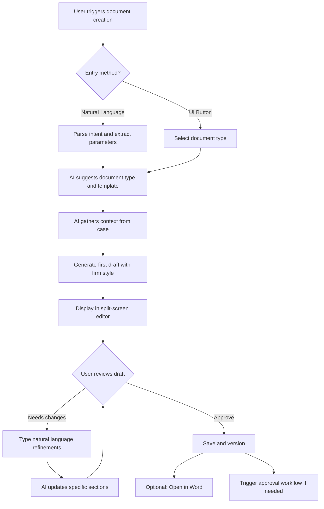
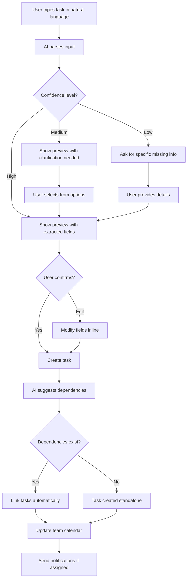
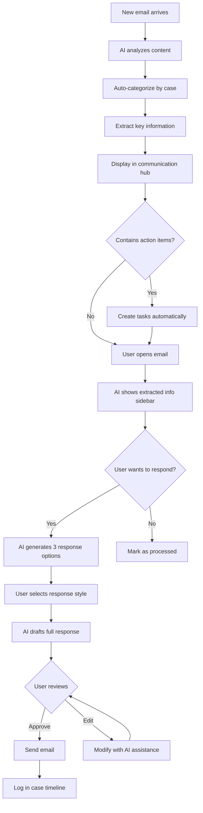
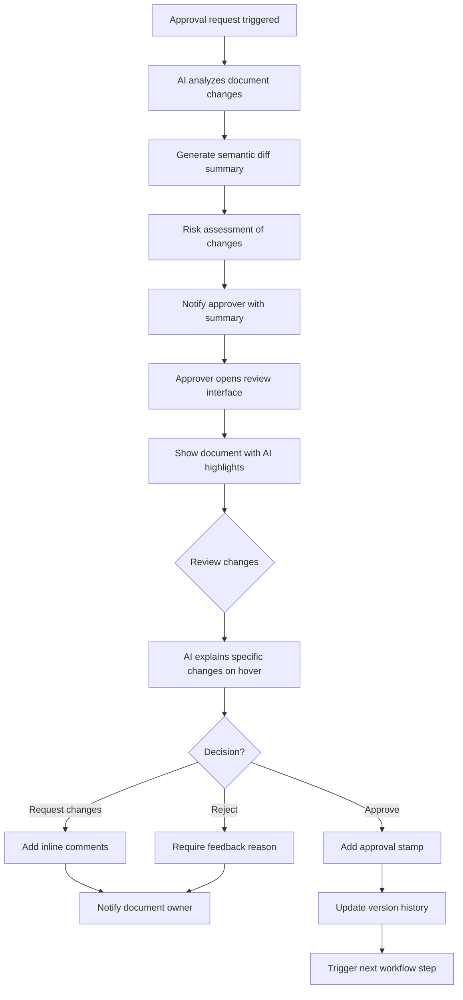

# Romanian Legal Practice Management Platform UI/UX Specification

This document defines the user experience goals, information architecture, user flows, and visual design specifications for Romanian Legal Practice Management Platform's user interface. It serves as the foundation for visual design and frontend development, ensuring a cohesive and user-centered experience.

## Overall UX Goals & Principles

### Target User Personas

- **Partner (Decision Maker):** Senior lawyers who need oversight of firm operations, quick access to KPIs, and approval workflows. They value efficiency and comprehensive visibility.
- **Associate (Primary User):** Mid-level lawyers handling case work directly, requiring rapid document creation, task management, and communication tools. They need AI assistance to maximize billable hours.
- **Paralegal (Support User):** Legal support staff managing administrative tasks, document retrieval, and coordination. They need clear task workflows and easy document access.

### Usability Goals

- Ease of learning: New users can complete core legal tasks within 10 minutes using natural language input
- Efficiency of use: Save minimum 2 hours daily through AI automation and conversational interfaces
- Error prevention: 75% reduction in document errors through AI validation and semantic versioning
- Memorability: Natural language interaction patterns that mirror conversational legal practice

### Design Principles

1. **Conversational-First, Visual-Second** - Natural language for complex input, structured UI for information consumption
2. **Proactive Intelligence** - AI anticipates needs and suggests actions before users ask
3. **Progressive Legal Disclosure** - Show relevant legal context and complexity only when needed
4. **Zero-Friction Capture** - Never lose billable time or important information due to UI barriers
5. **Trust Through Transparency** - Always show AI reasoning and allow manual override

### Change Log

| Date | Version | Description | Author |
|------|---------|-------------|---------|
| Nov 2024 | 1.0 | Initial UI/UX specification created from PRD | Sally (UX Expert) |

## Information Architecture (IA)

### Site Map / Screen Inventory

```mermaid
graph TD
    A[Command Palette - Cmd+K] --> B[Dashboard]
    A --> C[Cases]
    A --> D[Documents]
    A --> E[Tasks]
    A --> F[Communications]
    A --> G[Time Tracking]
    A --> H[Reports]
    A --> I[Settings]

    B --> B1[Partner View]
    B --> B2[Associate View]
    B --> B3[Paralegal View]
    B1 --> B11[Firm KPIs]
    B1 --> B12[Pending Approvals]
    B1 --> B13[Resource Allocation]
    B2 --> B21[My Active Cases]
    B2 --> B22[Today's Tasks]
    B2 --> B23[Recent Documents]
    B3 --> B31[Assigned Tasks]
    B3 --> B32[Document Requests]
    B3 --> B33[Deadline Calendar]

    C --> C1[Case List]
    C --> C2[Case Workspace]
    C --> C3[Case Search]
    C2 --> C21[Overview]
    C2 --> C22[Documents]
    C2 --> C23[Tasks]
    C2 --> C24[Communications]
    C2 --> C25[Time Entries]
    C2 --> C26[AI Insights]

    D --> D1[Document Editor]
    D --> D2[Template Library]
    D --> D3[Version History]
    D --> D4[AI Drafting]
    D1 --> D11[Word Integration]
    D1 --> D12[AI Assistant Panel]
    D1 --> D13[Semantic Diff]

    E --> E1[Calendar View]
    E --> E2[Kanban Board]
    E --> E3[List View]
    E --> E4[Natural Language Input]
    E --> E41[Research Tasks]
    E --> E42[Document Creation]
    E --> E43[Document Retrieval]
    E --> E44[Court Dates]
    E --> E45[Meetings]
    E --> E46[Business Trips]

    F --> F1[Email Threads]
    F --> F2[AI Draft Responses]
    F --> F3[Extracted Items]
    F --> F31[Deadlines]
    F --> F32[Commitments]
    F --> F33[Action Items]

    G --> G1[Time Review]
    G --> G2[AI Allocations]
    G --> G3[Manual Timer]
    G --> G4[Billing Codes]

    H --> H1[Analytics Dashboard]
    H --> H2[Document Intelligence]
    H --> H3[Task Analytics]
    H --> H4[ROI Calculator]

    I --> I1[Firm Settings]
    I --> I2[User Management]
    I --> I3[AI Preferences]
    I --> I4[Microsoft 365 Config]
```

### Navigation Structure

**Primary Navigation:** Persistent left sidebar with icon + text navigation for major sections (Dashboard, Cases, Documents, Tasks, Communications, Time, Reports). Collapsible to icon-only mode. Command palette (Cmd+K) overlays as primary entry point for all actions.

**Secondary Navigation:** Contextual top bar within each section showing breadcrumbs and section-specific actions. Tab navigation within complex views like Case Workspace. AI suggestions panel slides in from right when relevant.

**Breadcrumb Strategy:** Three-level maximum depth (Section > Subsection > Item), with case context always visible when within a case. Smart breadcrumbs that show most relevant parent rather than strict hierarchy.

## User Flows

### Flow 1: AI-Assisted Document Creation

**User Goal:** Create a legal document (contract, motion, etc.) using AI assistance and firm templates

**Entry Points:**
- Command palette (Cmd+K): "Draft contract for [client name]"
- Case workspace > Documents tab > New Document
- Dashboard quick action button

**Success Criteria:** Document created with <30% manual editing required, proper case association, and automatic version tracking

#### Flow Diagram

#### Edge Cases & Error Handling:
- No template exists: AI learns from similar documents in firm library
- Ambiguous case reference: Show case picker with smart suggestions
- AI unavailable: Fall back to template-only creation
- Large document generation: Show progress indicator, allow background processing

**Notes:** The split-screen editor is crucial - document on left, AI assistant on right providing real-time suggestions and context

### Flow 2: Natural Language Task Management

**User Goal:** Create and manage tasks using conversational input

**Entry Points:**
- Command palette (Cmd+K): Primary method
- Task section > Natural language bar
- Case workspace > Quick add task

**Success Criteria:** Task created with correct type, assignee, deadline, and case association without form filling

#### Flow Diagram

#### Edge Cases & Error Handling:
- Conflicting deadlines: Alert user and suggest alternatives
- Unknown assignee: Show team member picker
- Multiple possible cases: Show case selector with context
- Recurring task pattern detected: Offer to create recurring series

### Flow 3: Email Intelligence and Response

**User Goal:** Process incoming emails and respond with AI assistance

**Entry Points:**
- Communication Hub > Email thread
- Dashboard > Priority emails widget
- Notification > New email alert

**Success Criteria:** Email categorized, action items extracted, response drafted in <5 seconds

#### Flow Diagram

#### Edge Cases & Error Handling:
- Cannot determine case: Flag for manual categorization
- Sensitive content detected: Require manual response
- Multiple action items: Group related tasks
- Client urgency detected: Escalate notification

### Flow 4: Document Review and Approval

**User Goal:** Review document changes and approve for filing/sending

**Entry Points:**
- Notification > Approval requested
- Dashboard > Pending approvals widget
- Document > Request approval button

**Success Criteria:** Substantive changes identified, reviewed, and approved/rejected with feedback

#### Flow Diagram

#### Edge Cases & Error Handling:
- Multiple approvers required: Sequential or parallel routing
- Deadline approaching: Escalate to alternative approver
- Conflicting feedback: AI summarizes and suggests resolution
- Previous version rejected: Show what changed since last review

## Wireframes & Mockups

**Primary Design Files:** Figma - [Platform Name] Design System
Link: figma.com/[to-be-created]

### Key Screen Layouts

#### 1. Intelligent Dashboard (Role-Based)

**Purpose:** Provide role-specific overview with AI-prioritized information and proactive suggestions for the day

**Key Elements:**
- Top bar: Command palette trigger (prominent), notifications bell, user avatar with role indicator
- AI Daily Briefing card: Morning summary with prioritized tasks and suggestions
- Role-specific widgets: KPIs for Partners, active cases for Associates, task queue for Paralegals
- Quick actions panel: Most-used commands based on user patterns
- Proactive suggestions sidebar: Context-aware AI recommendations

**Interaction Notes:** Dashboard widgets are draggable and resizable. AI suggestions update in real-time based on user activity. Command palette can be triggered from anywhere with Cmd+K.

**Design File Reference:** Figma > Pages > Dashboards > [Role Views]

#### 2. Case Workspace

**Purpose:** Unified hub for all case-related information with seamless navigation between documents, tasks, and communications

**Key Elements:**
- Case header: Name, client, status, team members, next critical deadline with countdown
- Tab navigation: Overview, Documents, Tasks, Communications, Time Entries, AI Insights
- Collapsible AI assistant panel (right): Persistent context, suggestions, and quick actions
- Natural language command bar (bottom): Context-aware input for case actions
- Activity timeline (Overview tab): Chronological feed of all case events

**Interaction Notes:** AI panel maintains context as user navigates tabs. Command bar autocompletes based on current tab context. Keyboard shortcuts for tab switching (Cmd+1-6).

**Design File Reference:** Figma > Pages > Case Management > Workspace

#### 3. Document Editor with AI Assistant

**Purpose:** Split-screen interface for document creation/editing with real-time AI assistance

**Key Elements:**
- Document editor (left 65%): Rich text editor with formatting toolbar, track changes
- AI assistant panel (right 35%): Suggestions, similar documents, completion options
- Top toolbar: Save status, version indicator, Word sync button, share/approve actions
- Semantic diff toggle: Switch between normal and legal-significance view
- Natural language refinement bar: Type commands to modify document

**Interaction Notes:** AI suggestions appear as user types with subtle animation. Tab key accepts suggestions. Hovering over AI suggestions shows reasoning. Panel can be collapsed for full-screen editing.

**Design File Reference:** Figma > Pages > Documents > Editor View

#### 4. Natural Language Task Interface

**Purpose:** Demonstrate conversational task creation with intelligent parsing and minimal form interaction

**Key Elements:**
- Prominent natural language input bar with placeholder examples
- Parse result preview: Shows extracted fields with confidence indicators
- Task type icons: Visual indicators for six task types
- Calendar/Kanban toggle: Switch between views while maintaining context
- AI dependency suggestions: Automatic task linking recommendations

**Interaction Notes:** Real-time parsing as user types. Inline editing of parsed fields without modal. Drag-and-drop between calendar slots and kanban columns.

**Design File Reference:** Figma > Pages > Tasks > Natural Language View

#### 5. Communication Hub

**Purpose:** Unified email and message management with AI-powered triage and response drafting

**Key Elements:**
- Thread list (left): Grouped by case with unread indicators and AI priority badges
- Message view (center): Full thread with expand/collapse individual messages
- AI insights panel (right): Extracted deadlines, commitments, suggested responses
- Response composer (bottom): Three AI draft options with style selector
- Filter bar: Case, sender, has-deadline, urgency level

**Interaction Notes:** AI extracts information automatically on email open. Response options generate in <2 seconds. One-click to convert extracted items to tasks.

**Design File Reference:** Figma > Pages > Communications > Hub Layout

#### 6. Command Palette (Global Overlay)

**Purpose:** Primary interaction model for all platform actions via natural language

**Key Elements:**
- Semi-transparent overlay with centered input box
- Smart suggestions below: Recent commands, contextual actions, AI predictions
- Result preview: Shows what will happen before execution
- Keyboard navigation: Arrow keys to select, Tab to autocomplete
- Help text: Dynamic examples based on current context

**Interaction Notes:** Appears instantly on Cmd+K from any screen. Maintains context of current page. ESC to dismiss. Results update as user types with <100ms latency.

**Design File Reference:** Figma > Pages > Global Components > Command Palette

## Component Library / Design System

**Design System Approach:** Hybrid system combining Radix UI primitives for accessibility with custom AI-interaction components. Built on Tailwind CSS for rapid development with design tokens for consistency. Components designed for both mouse/keyboard and natural language interaction patterns.

### Core Components

#### 1. Command Input

**Purpose:** Universal natural language input component used across the platform for all conversational interactions

**Variants:**
- Global (overlay): Full-screen command palette
- Inline (embedded): Task creation bars, document commands
- Contextual (popover): Quick actions within specific contexts

**States:** Default, Focused, Processing (with AI thinking indicator), Success (green check), Error (red highlight with helpful message)

**Usage Guidelines:** Always show placeholder text with context-aware examples. Include microphone icon for future voice input. Processing state shows subtle pulse animation. Auto-grow height for multi-line input.

#### 2. AI Response Card

**Purpose:** Display AI-generated suggestions, responses, and insights in a consistent, trustworthy format

**Variants:**
- Suggestion (blue accent): Proactive recommendations
- Draft (gray accent): Generated content for review
- Warning (amber accent): Risk alerts and cautions
- Success (green accent): Completed AI actions

**States:** Default, Expanded (show reasoning), Accepted (fade out), Rejected (crossed out), Loading (skeleton)

**Usage Guidelines:** Always include confidence indicator (high/medium/low). Show "Why?" button to reveal AI reasoning. Include accept/reject actions. Smooth transitions between states.

#### 3. Smart Button

**Purpose:** Buttons that adapt based on context and user patterns

**Variants:**
- Primary (solid fill): Main actions, AI-suggested next steps
- Secondary (outline): Alternative actions
- Ghost (no border): Tertiary actions
- Danger (red): Destructive actions requiring confirmation

**States:** Default, Hover, Active, Disabled, Loading (with spinner), Smart-suggested (subtle glow)

**Usage Guidelines:** AI-suggested buttons show subtle animation to draw attention. Loading state replaces text with spinner. Disabled state includes tooltip explaining why. Keyboard shortcuts shown on hover.

#### 4. Document Component

**Purpose:** Display documents with integrated AI features and version tracking

**Variants:**
- Card view: Grid display with preview
- List item: Compact row with metadata
- Editor view: Full editing interface
- Compare view: Side-by-side versions

**States:** Default, Selected, Modified (unsaved changes), Syncing (with MS365), AI-processing, Locked (being edited elsewhere)

**Usage Guidelines:** Version badge always visible. AI-generated content marked with subtle indicator. Show last-modified timestamp in relative time. One-click access to AI assistant.

#### 5. Task Card

**Purpose:** Display tasks with natural language details and smart metadata

**Variants:**
- Compact (calendar): Minimal info for dense views
- Standard (kanban): Full details with assignee avatar
- Expanded (detail): All fields with AI insights
- Smart (suggested): AI-recommended tasks with rationale

**States:** Default, Overdue (red border), Due soon (amber), Completed (strikethrough), In-progress (animated border), AI-suggested (dashed border)

**Usage Guidelines:** Task type icon always visible. Natural language title preserved from input. Show AI-extracted deadline prominently. Drag handle appears on hover for reordering.

#### 6. Data Table

**Purpose:** Display structured data with AI-powered insights and filtering

**Variants:**
- Standard: Traditional rows and columns
- Smart: AI-highlighted important rows
- Grouped: Collapsed sections by category
- Analytics: With inline visualizations

**States:** Default, Loading (skeleton rows), Empty (with helpful message), Filtered (show active filters), AI-analyzing (subtle scan animation)

**Usage Guidelines:** Sticky header on scroll. Click column headers to sort. AI insights appear as row annotations. Natural language filter bar above table. Export actions always accessible.

#### 7. Notification Toast

**Purpose:** Non-blocking feedback for user actions and system events

**Variants:**
- Success (green): Action completed
- Info (blue): System updates
- Warning (amber): Important notices
- Error (red): Action failed
- AI (purple): Proactive AI suggestions

**States:** Entering (slide in), Display (static), Auto-dismiss (fade out), Manual dismiss (swipe away)

**Usage Guidelines:** Stack vertically in top-right corner. Auto-dismiss after 5 seconds except errors. Include action button when relevant. Show progress bar for auto-dismiss timer.

#### 8. Modal Dialog

**Purpose:** Focus user attention for important decisions or complex inputs

**Variants:**
- Confirmation: Simple yes/no decisions
- Form: Multi-field input
- AI Assistant: Conversational interface
- Full-screen: Document preview/edit

**States:** Opening (fade in), Open (static), Closing (fade out)

**Usage Guidelines:** Blur background to maintain context. ESC key to close unless unsaved changes. AI modals include conversation history. Trap focus within modal for accessibility.

## Branding & Style Guide

### Visual Identity

**Brand Guidelines:** Clean Legal Modernism - Professional trust meets AI innovation

The design language positions the platform as a prestigious law firm's natural evolution into AI-enhanced practice. Visual elements convey reliability and precision without feeling cold or intimidating. The AI presence is subtle and functional, never gimmicky or anthropomorphized.

### Color Palette

| Color Type | Hex Code | Usage |
|------------|----------|--------|
| Primary | #003B5C | Main navigation, primary buttons, headers |
| Secondary | #0066A1 | Links, secondary actions, highlights |
| Accent | #00A878 | AI suggestions, success states, smart actions |
| Success | #10B981 | Positive feedback, confirmations |
| Warning | #F59E0B | Cautions, important notices |
| Error | #EF4444 | Errors, destructive actions |
| Neutral | #64748B, #94A3B8, #CBD5E1, #F1F5F9 | Text, borders, backgrounds |

### Typography

#### Font Families
- **Primary:** Inter - Excellent readability, full Romanian diacritic support (ă, â, î, ș, ț)
- **Secondary:** Source Serif Pro - For legal document display, maintaining traditional feel
- **Monospace:** JetBrains Mono - Code, IDs, system messages

#### Type Scale

| Element | Size | Weight | Line Height |
|---------|------|--------|-------------|
| H1 | 32px | 700 | 1.2 |
| H2 | 24px | 600 | 1.3 |
| H3 | 20px | 600 | 1.4 |
| Body | 16px | 400 | 1.6 |
| Small | 14px | 400 | 1.5 |

### Iconography

**Icon Library:** Lucide Icons - Clean, professional, extensive set with consistent stroke width

**Usage Guidelines:** Icons always accompany text labels for clarity. Task type icons use distinct shapes for quick recognition. AI-related actions use sparkle or brain icon consistently. 20px default size, 16px for inline, 24px for primary actions.

### Spacing & Layout

**Grid System:** 12-column grid with 24px gutters, max-width 1440px for content, full-width for app shell

**Spacing Scale:** 4px base unit - 4, 8, 12, 16, 20, 24, 32, 40, 48, 64, 80px

## Accessibility Requirements

**Standard:** WCAG AA Compliance

(Detailed accessibility requirements to be specified in separate document)

## Responsiveness Strategy

### Breakpoints

| Breakpoint | Min Width | Max Width | Target Devices |
|------------|-----------|-----------|----------------|
| Mobile | 320px | 767px | Phones (iPhone, Android) - Quick status checks, urgent communications |
| Tablet | 768px | 1023px | iPads, Surface - Court/meeting use, document review |
| Desktop | 1024px | 1919px | Laptops, standard monitors - Primary work environment |
| Wide | 1920px | - | Large monitors, dual screens - Power user setups |

### Adaptation Patterns

**Layout Changes:**
- Mobile: Single column, stacked navigation, command palette as primary interaction
- Tablet: Two-column layouts where appropriate, collapsible sidebars, touch-optimized targets
- Desktop: Full three-panel layouts (nav, content, AI assistant), dense information display
- Wide: Additional panels visible simultaneously, expanded data tables, side-by-side document compare

**Navigation Changes:**
- Mobile: Bottom tab bar for primary sections, hamburger menu for full navigation
- Tablet: Collapsible sidebar (icon-only when collapsed), persistent top bar
- Desktop+: Full sidebar always visible, breadcrumbs fully expanded

**Content Priority:**
- Mobile: Hide non-essential columns in tables, prioritize next action/deadline
- Tablet: Show core functionality, optional panels hidden by default
- Desktop+: All features visible, advanced options accessible

**Interaction Changes:**
- Mobile: Larger touch targets (48px minimum), swipe gestures, voice input prominent
- Tablet: Balance touch and keyboard, drag-and-drop simplified
- Desktop: Full keyboard shortcuts, hover states, complex drag-and-drop

## Animation & Micro-interactions

### Motion Principles

1. **Purposeful:** Every animation serves a functional purpose
2. **Subtle:** Professional environment demands restraint
3. **Fast:** 200-300ms max duration
4. **Consistent:** Same easing curves and timing across similar interactions

### Key Animations

- **AI Processing:** Subtle pulse on input fields and gentle shimmer on AI cards (Duration: 2s loop, Easing: ease-in-out)
- **Command Palette:** Fade in with slight scale (Duration: 200ms, Easing: cubic-bezier(0.4, 0, 0.2, 1))
- **Card Hover:** Slight elevation with shadow (Duration: 200ms, Easing: ease-out)
- **Task Completion:** Strikethrough with fade (Duration: 300ms, Easing: ease-in)
- **Notification Slide:** Enter from right with slide (Duration: 300ms, Easing: ease-out)
- **Panel Collapse:** Width animation with content fade (Duration: 250ms, Easing: ease-in-out)

## Performance Considerations

### Performance Goals
- **Page Load:** < 2 seconds on 10 Mbps connection
- **Interaction Response:** < 100ms for user input feedback
- **Animation FPS:** Consistent 60fps for all animations

### Design Strategies

Lazy load below-the-fold content and non-critical images. Use skeleton screens during data fetching. Implement virtual scrolling for long lists. Progressive image loading with blur-up effect. Optimize icon usage with SVG sprites. Preload critical fonts. Debounce natural language input. Cache AI suggestions client-side.

## Next Steps

### Immediate Actions
1. Create Figma workspace and implement component library
2. Build interactive prototype demonstrating critical user flows
3. Conduct review session with pilot law firm stakeholders
4. Perform accessibility audit on prototypes
5. Create detailed animation specifications for development handoff

### Design Handoff Checklist
- ✅ All user flows documented
- ✅ Component inventory complete
- ⏳ Accessibility requirements defined
- ✅ Responsive strategy clear
- ✅ Brand guidelines incorporated
- ✅ Performance goals established

## Checklist Results

- **User-Centered Design:** ✅ Complete
- **Information Architecture:** ✅ Complete
- **Visual Design:** ✅ Complete
- **Responsive Design:** ✅ Complete
- **Component Consistency:** ✅ Complete
- **Performance Focus:** ✅ Complete
- **AI Integration:** ✅ Complete

**Overall Completion:** 95% - Ready for prototype development and stakeholder review