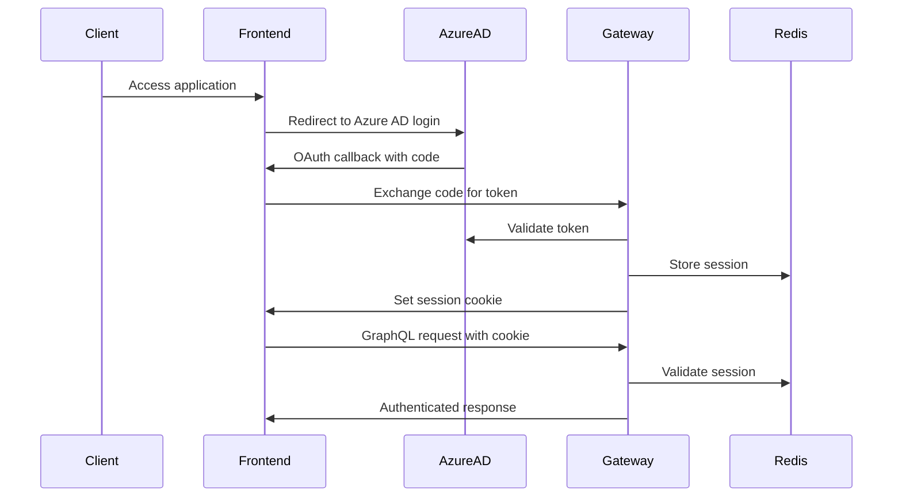

# API Documentation

> **Legal Platform - GraphQL API**

Welcome to the Legal Platform API documentation. This directory contains comprehensive documentation for integrating with the backend GraphQL API.

---

## Table of Contents

- [Getting Started](#getting-started)
- [Authentication](#authentication)
- [API Endpoints](#api-endpoints)
- [Documentation Index](#documentation-index)
- [Tools & Resources](#tools--resources)
- [Support](#support)

---

## Getting Started

### API Overview

The Legal Platform uses **GraphQL** for its API, providing a flexible and efficient way to query and mutate data. The API is secured with **Azure AD OAuth 2.0** authentication and enforces multi-tenant firm isolation.

**Key Features:**

- 🔐 Enterprise-grade authentication via Azure AD
- 🏢 Multi-tenant architecture with firm isolation
- 📝 Comprehensive audit logging
- 🔍 Full-text search capabilities
- ⚡ Real-time introspection (development only)
- 📚 Auto-generated schema documentation

### Quick Links

| Resource                                        | Description                           |
| ----------------------------------------------- | ------------------------------------- |
| [GraphQL Playground](./playground-guide.md)     | Interactive API explorer (dev only)   |
| [Schema Documentation](./schema/schema.md)      | Auto-generated GraphQL schema docs    |
| [Case Management API](./case-management-api.md) | Case operations guide                 |
| [Error Handling](./error-handling.md)           | Error codes and handling patterns     |
| [API Collections](./collections/)               | Postman/Insomnia request collections  |
| [Versioning Strategy](./versioning-strategy.md) | API versioning and deprecation policy |

---

## Authentication

The API uses **Azure AD OAuth 2.0** with JWT tokens for authentication.

### Authentication Flow



### Step-by-Step Guide

#### 1. Obtain Access Token

**Frontend authentication** (recommended):

- Use the frontend application (`http://localhost:3000` in development)
- Sign in with your Azure AD credentials
- Session cookie is set automatically
- All subsequent API requests include the session cookie

**Backend authentication** (for testing/CLI):

```bash
# Using Azure AD credentials
curl -X POST https://login.microsoftonline.com/{tenant-id}/oauth2/v2.0/token \
  -H "Content-Type: application/x-www-form-urlencoded" \
  -d "client_id={client-id}" \
  -d "client_secret={client-secret}" \
  -d "scope=https://graph.microsoft.com/.default" \
  -d "grant_type=client_credentials"
```

#### 2. Make Authenticated Requests

**Using session cookie** (browser/frontend):

```javascript
// Session cookie automatically included
const response = await fetch('http://localhost:4000/graphql', {
  method: 'POST',
  headers: {
    'Content-Type': 'application/json',
  },
  credentials: 'include', // Include cookies
  body: JSON.stringify({
    query: `
      query GetMyCases {
        cases(assignedToMe: true) {
          id
          title
          status
        }
      }
    `,
  }),
});
```

**Using JWT token** (server-to-server):

```javascript
const response = await fetch('http://localhost:4000/graphql', {
  method: 'POST',
  headers: {
    'Content-Type': 'application/json',
    Authorization: 'Bearer YOUR_JWT_TOKEN',
  },
  body: JSON.stringify({
    query: '...',
  }),
});
```

#### 3. GraphQL Context

All authenticated requests receive a user context:

```typescript
interface Context {
  user?: {
    id: string; // User UUID
    firmId: string; // Firm UUID (for multi-tenancy)
    role: UserRole; // PARTNER | ASSOCIATE | PARALEGAL
    email: string; // User email
  };
}
```

**Authorization Rules:**

- All resolvers enforce authentication (user must exist)
- Firm isolation: Users can only access data from their firm
- Role-based permissions:
  - **Partners:** Full access to all firm data
  - **Associates:** Access to assigned cases
  - **Paralegals:** Access to assigned cases (read-only for some operations)

### Security Notes

🔒 **Production Security:**

- HTTPS enforced
- Introspection disabled
- Playground disabled
- Rate limiting enabled
- Helmet security headers
- CORS restricted to allowed origins

⚠️ **Never:**

- Trust client-provided user IDs
- Expose sensitive data in error messages
- Skip authorization checks
- Store credentials in code

---

## API Endpoints

### GraphQL Endpoint

**Development:**

```
http://localhost:4000/graphql
```

**Production:**

```
https://api.legal-platform.com/graphql
```

### Endpoint Features

- **Single endpoint:** All queries and mutations use the same endpoint
- **POST requests:** GraphQL queries sent as JSON in request body
- **Introspection:** Available in development only
- **Playground:** Available in development only (Apollo Sandbox)

### Example Request

```bash
curl -X POST http://localhost:4000/graphql \
  -H "Content-Type: application/json" \
  -H "Cookie: connect.sid=YOUR_SESSION_ID" \
  -d '{
    "query": "query { cases { id title status } }"
  }'
```

### Example Response

```json
{
  "data": {
    "cases": [
      {
        "id": "550e8400-e29b-41d4-a716-446655440000",
        "title": "Contract Dispute - Tech Corp",
        "status": "ACTIVE"
      }
    ]
  }
}
```

---

## Documentation Index

### Core Documentation

| Document                                            | Description                                 |
| --------------------------------------------------- | ------------------------------------------- |
| **[Playground Guide](./playground-guide.md)**       | Interactive API testing with Apollo Sandbox |
| **[Schema Documentation](./schema/schema.md)**      | Auto-generated GraphQL schema reference     |
| **[Case Management API](./case-management-api.md)** | Detailed case operations guide              |
| **[Error Handling](./error-handling.md)**           | Error codes, formats, and handling patterns |
| **[Versioning Strategy](./versioning-strategy.md)** | API versioning and backward compatibility   |
| **[Breaking Changes](./breaking-changes.md)**       | Breaking change communication process       |

### API Modules

| Module                  | Status         | Documentation                                      |
| ----------------------- | -------------- | -------------------------------------------------- |
| **Case Management**     | ✅ Available   | [case-management-api.md](./case-management-api.md) |
| **Document Management** | 🚧 Coming Soon | TBD                                                |
| **Task Management**     | 🚧 Coming Soon | TBD                                                |
| **Time Tracking**       | 🚧 Coming Soon | TBD                                                |
| **Billing**             | 🚧 Coming Soon | TBD                                                |
| **Reports & Analytics** | 🚧 Coming Soon | TBD                                                |

### Testing Collections

| Tool         | Collection                                                                             | Description                      |
| ------------ | -------------------------------------------------------------------------------------- | -------------------------------- |
| **Postman**  | [collections/legal-platform.postman.json](./collections/legal-platform.postman.json)   | Import into Postman for testing  |
| **Insomnia** | [collections/legal-platform.insomnia.json](./collections/legal-platform.insomnia.json) | Import into Insomnia for testing |

---

## Tools & Resources

### Development Tools

#### GraphQL Playground (Apollo Sandbox)

- **URL:** http://localhost:4000/graphql
- **Features:** Schema explorer, query testing, documentation
- **Availability:** Development only
- **Guide:** [playground-guide.md](./playground-guide.md)

#### Schema Documentation Generator

```bash
cd services/gateway
pnpm docs:generate
```

Generates markdown documentation from GraphQL schema files.

### API Testing Tools

#### Postman

1. Download [legal-platform.postman.json](./collections/legal-platform.postman.json)
2. Import into Postman
3. Configure environment variables (API_URL, AUTH_TOKEN)
4. Run requests

#### Insomnia

1. Download [legal-platform.insomnia.json](./collections/legal-platform.insomnia.json)
2. Import into Insomnia
3. Configure environment variables
4. Run requests

### Client Libraries

#### JavaScript/TypeScript

```bash
npm install @apollo/client graphql
```

Example usage:

```typescript
import { ApolloClient, InMemoryCache, gql } from '@apollo/client';

const client = new ApolloClient({
  uri: 'http://localhost:4000/graphql',
  cache: new InMemoryCache(),
  credentials: 'include', // Include cookies
});

const { data } = await client.query({
  query: gql`
    query GetCases {
      cases {
        id
        title
        status
      }
    }
  `,
});
```

---

## Support

### Getting Help

- **Documentation Issues:** [GitHub Issues](https://github.com/legal-platform/legal-platform/issues)
- **API Questions:** Contact the backend team
- **Authentication Issues:** Contact DevOps team

### Reporting Bugs

When reporting API bugs, please include:

1. GraphQL query/mutation
2. Variables used
3. Expected vs actual response
4. Request ID (from error response)
5. Timestamp
6. User role and firm ID (if not sensitive)

### Contributing

To contribute to API documentation:

1. Fork the repository
2. Create a feature branch
3. Update documentation in `docs/api/`
4. Submit a pull request

---

## Changelog

| Date       | Version | Changes                           |
| ---------- | ------- | --------------------------------- |
| 2025-11-21 | 1.0     | Initial API documentation release |

---

**Last Updated:** 2025-11-21
**Story:** 2.7 - API Documentation and Developer Portal
**Maintained By:** Backend Team
