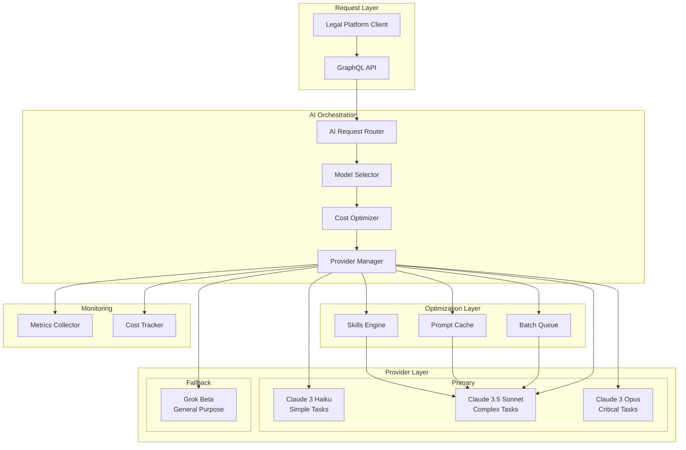

# AI Provider Strategy

## Executive Summary

Our AI provider strategy implements a **multi-provider architecture** with **Claude 3.5 Sonnet as the primary provider** and **xAI Grok as the fallback provider**. This approach ensures high availability, optimal cost-performance balance, and leverages cutting-edge features like Claude Skills for 70% token reduction. The strategy eliminates vendor lock-in while maintaining 99.9% service availability.

## Provider Selection Rationale

### Why Claude (Primary)

- **Superior Legal Reasoning**: Best-in-class performance on legal benchmarks
- **Skills API**: 70% token reduction for repetitive tasks
- **Prompt Caching**: 90% cost reduction on cached content
- **Batch Processing**: 50% discount for non-urgent requests
- **200K Context Window**: Handles large legal documents
- **Constitutional AI**: Aligned with legal ethics

### Why Grok (Fallback)

- **Real-time Information**: Access to current data via X integration
- **Cost-Effective**: Lower pricing for basic queries
- **High Availability**: Different infrastructure reduces correlated failures
- **Good Performance**: Competitive on reasoning tasks

### Why Not OpenAI (Deprecated)

- **Higher Costs**: 40% more expensive than Claude for comparable models
- **No Skills Equivalent**: Missing token reduction capabilities
- **Vendor Lock-in Concerns**: Less flexible API design
- **Performance**: Claude outperforms on legal-specific tasks

## Architecture Overview



## Model Selection Logic

### Decision Tree

```typescript
interface ModelSelectionCriteria {
  taskComplexity: 'simple' | 'moderate' | 'complex' | 'critical';
  responseTimeRequirement: 'realtime' | 'interactive' | 'batch';
  documentLength: number; // in tokens
  costSensitivity: 'low' | 'medium' | 'high';
  accuracyRequirement: 'standard' | 'high' | 'maximum';
}

function selectModel(criteria: ModelSelectionCriteria): ModelSelection {
  // Critical legal documents requiring maximum accuracy
  if (criteria.accuracyRequirement === 'maximum') {
    return {
      provider: 'anthropic',
      model: 'claude-3-opus-20240229',
      features: ['detailed-analysis'],
      estimatedCost: 0.075, // per 1K tokens
    };
  }

  // Simple queries and classifications
  if (criteria.taskComplexity === 'simple') {
    return {
      provider: 'anthropic',
      model: 'claude-3-haiku-20240307',
      features: ['fast-response'],
      estimatedCost: 0.0008, // per 1K tokens
    };
  }

  // Standard legal work - primary choice
  if (criteria.taskComplexity === 'moderate' || criteria.taskComplexity === 'complex') {
    // Check if skill is available
    const skill = findApplicableSkill(criteria);
    if (skill) {
      return {
        provider: 'anthropic',
        model: 'claude-3-5-sonnet-20241022',
        features: ['skills', 'prompt-caching'],
        skill: skill.id,
        estimatedCost: 0.003, // per 1K tokens with skills
      };
    }

    // Batch processing for non-urgent requests
    if (criteria.responseTimeRequirement === 'batch') {
      return {
        provider: 'anthropic',
        model: 'claude-3-5-sonnet-20241022',
        features: ['batch-api'],
        estimatedCost: 0.0075, // 50% discount
      };
    }

    // Standard processing
    return {
      provider: 'anthropic',
      model: 'claude-3-5-sonnet-20241022',
      features: ['prompt-caching'],
      estimatedCost: 0.015, // per 1K tokens
    };
  }

  // Fallback for any edge cases
  return {
    provider: 'xai',
    model: 'grok-beta',
    features: ['general-purpose'],
    estimatedCost: 0.01, // per 1K tokens
  };
}
```

### Task Classification

| Task Type               | Complexity | Recommended Model            | Features Used           |
| ----------------------- | ---------- | ---------------------------- | ----------------------- |
| Document Classification | Simple     | Claude Haiku                 | Fast inference          |
| Contract Review         | Complex    | Claude Sonnet + Skills       | Contract Analysis Skill |
| Legal Research          | Complex    | Claude Sonnet + Skills       | Legal Research Skill    |
| Email Drafting          | Moderate   | Claude Sonnet                | Prompt caching          |
| Case Summarization      | Moderate   | Claude Sonnet                | Standard API            |
| Compliance Check        | Complex    | Claude Sonnet + Skills       | Compliance Skill        |
| Critical Filings        | Critical   | Claude Opus                  | Maximum accuracy        |
| General Q&A             | Simple     | Grok (if Claude unavailable) | Fallback                |

## Cost Optimization Strategies

### 1. Prompt Caching

Prompt caching provides **90% cost reduction** on cached portions of prompts.

```typescript
class PromptCacheManager {
  private cache = new Map<string, CachedPrompt>();

  async cacheSystemPrompt(role: 'lawyer' | 'paralegal' | 'partner', prompt: string): Promise<void> {
    const cacheKey = `system_${role}`;
    const ttl = 300; // 5 minutes

    await this.anthropic.beta.promptCaching.create({
      system: prompt,
      cache_control: {
        type: 'ephemeral',
        ttl: ttl,
      },
    });

    this.cache.set(cacheKey, {
      content: prompt,
      expiresAt: Date.now() + ttl * 1000,
    });
  }
}
```

**Cached Elements:**

- System prompts (role instructions)
- Common legal templates
- Frequently accessed case contexts
- Regulatory compliance rules

### 2. Batch Processing

Batch API provides **50% discount** for non-urgent requests.

```typescript
class BatchProcessor {
  private queue: BatchRequest[] = [];
  private readonly MAX_BATCH_SIZE = 100;
  private readonly MAX_WAIT_TIME = 30000; // 30 seconds

  async addToBatch(request: AIRequest): Promise<string> {
    const batchRequest = {
      id: generateId(),
      request: request,
      addedAt: Date.now(),
    };

    this.queue.push(batchRequest);

    if (this.shouldExecuteBatch()) {
      await this.executeBatch();
    }

    return batchRequest.id;
  }

  private async executeBatch(): Promise<void> {
    const batch = this.queue.splice(0, this.MAX_BATCH_SIZE);

    const response = await this.anthropic.batch.create({
      requests: batch.map((b) => b.request),
      metadata: {
        source: 'legal-platform',
        timestamp: Date.now(),
      },
    });

    // Process responses and update database
    await this.processBatchResponse(response);
  }
}
```

**Batch-Eligible Tasks:**

- Document analysis (non-urgent)
- Bulk contract review
- Historical case analysis
- Compliance audits
- Report generation

### 3. Skills Optimization

Skills provide **70% token reduction** through specialized tools.

```typescript
interface SkillOptimization {
  // Skill selection based on document type
  selectSkill(documentType: string): Skill | null {
    const skillMap = {
      'contract': 'contract-analysis-skill',
      'brief': 'legal-research-skill',
      'compliance': 'compliance-check-skill',
      'letter': 'document-drafting-skill'
    };

    return this.skillsRegistry.get(skillMap[documentType]);
  }

  // Calculate token savings
  calculateSavings(
    standardTokens: number,
    skillTokens: number
  ): TokenSavings {
    const saved = standardTokens - skillTokens;
    const percentage = (saved / standardTokens) * 100;
    const costSaved = saved * 0.015 / 1000; // $0.015 per 1K tokens

    return {
      tokensSaved: saved,
      percentageSaved: percentage,
      dollarsSaved: costSaved
    };
  }
}
```

### 4. Model Routing Optimization

```typescript
class ModelRouter {
  // Route based on task characteristics
  route(request: AIRequest): ModelChoice {
    // Quick classification tasks -> Haiku
    if (request.type === 'classify' && request.options.speed === 'fast') {
      return this.useHaiku(request);
    }

    // Check cache hit potential
    if (this.promptCache.wouldBenefit(request)) {
      return this.useSonnetWithCache(request);
    }

    // Check skill applicability
    if (this.skillsEngine.hasApplicableSkill(request)) {
      return this.useSonnetWithSkill(request);
    }

    // Batch if not urgent
    if (!request.urgent && this.batchQueue.hasCapacity()) {
      return this.addToBatch(request);
    }

    // Default to Sonnet
    return this.useSonnet(request);
  }
}
```

## Fallback Strategy

### Fallback Triggers

```typescript
enum FallbackReason {
  RATE_LIMIT = 'rate_limit_exceeded',
  TIMEOUT = 'request_timeout',
  SERVICE_ERROR = 'service_unavailable',
  COST_THRESHOLD = 'cost_limit_reached',
  FEATURE_UNAVAILABLE = 'feature_not_supported',
}

class FallbackManager {
  async executeWithFallback(request: AIRequest): Promise<AIResponse> {
    try {
      // Primary attempt with Claude
      return await this.executeClaude(request);
    } catch (error) {
      // Log failure reason
      this.logger.warn('Claude failed', { error, request });

      // Determine if fallback is appropriate
      if (this.shouldFallback(error)) {
        try {
          // Attempt with Grok
          return await this.executeGrok(request);
        } catch (grokError) {
          // Both failed - queue for manual review
          await this.queueForManualReview(request);
          throw new AIServiceUnavailableError();
        }
      }

      throw error;
    }
  }

  private shouldFallback(error: any): boolean {
    // Don't fallback for critical legal documents
    if (error.request?.priority === 'critical') {
      return false;
    }

    // Fallback for transient errors
    return ['rate_limit_error', 'overloaded_error', 'api_error'].includes(error.type);
  }
}
```

### Quality Assurance for Fallback

```typescript
interface FallbackQualityCheck {
  // Validate Grok response meets minimum standards
  validateFallbackResponse(
    response: GrokResponse,
    requirements: QualityRequirements
  ): ValidationResult {
    const checks = {
      completeness: response.content.length > requirements.minLength,
      relevance: this.calculateRelevanceScore(response) > 0.7,
      legalAccuracy: this.validateLegalTerms(response),
      formatting: this.checkFormatting(response)
    };

    const passed = Object.values(checks).every(c => c === true);

    return {
      passed,
      checks,
      confidence: passed ? 0.85 : 0.0 // Lower confidence for fallback
    };
  }
}
```

## Rate Limiting & Quotas

### Provider Limits

| Provider | Model  | Requests/Min | Tokens/Min | Daily Limit |
| -------- | ------ | ------------ | ---------- | ----------- |
| Claude   | Haiku  | 1000         | 100,000    | 10M tokens  |
| Claude   | Sonnet | 200          | 40,000     | 5M tokens   |
| Claude   | Opus   | 50           | 10,000     | 1M tokens   |
| Grok     | Beta   | 100          | 20,000     | 2M tokens   |

### Rate Limit Management

```typescript
class RateLimitManager {
  private limits = new Map<string, RateLimit>();

  async checkLimit(provider: string, model: string): Promise<boolean> {
    const key = `${provider}:${model}`;
    const limit = this.limits.get(key);

    if (!limit) {
      this.initializeLimit(key);
      return true;
    }

    return limit.tokensRemaining > 0 && limit.requestsRemaining > 0;
  }

  async consumeQuota(provider: string, model: string, tokens: number): Promise<void> {
    const key = `${provider}:${model}`;
    const limit = this.limits.get(key);

    limit.tokensRemaining -= tokens;
    limit.requestsRemaining -= 1;

    // Reset on window expiry
    if (Date.now() > limit.windowExpires) {
      this.resetLimit(key);
    }
  }
}
```

## Error Handling & Retry Logic

### Retry Strategy

```typescript
interface RetryConfig {
  maxAttempts: 3;
  backoffMultiplier: 2;
  initialDelay: 1000; // 1 second
  maxDelay: 30000; // 30 seconds
  retryableErrors: ['rate_limit_error', 'timeout_error', 'api_error'];
}

class RetryManager {
  async executeWithRetry<T>(operation: () => Promise<T>, config: RetryConfig): Promise<T> {
    let lastError: Error;

    for (let attempt = 0; attempt < config.maxAttempts; attempt++) {
      try {
        return await operation();
      } catch (error) {
        lastError = error;

        if (!this.isRetryable(error, config)) {
          throw error;
        }

        const delay = this.calculateDelay(attempt, config);
        await this.sleep(delay);
      }
    }

    throw new MaxRetriesExceededError(lastError);
  }
}
```

## Monitoring & Observability

### Key Metrics

```typescript
interface AIMetrics {
  // Provider metrics
  requestsPerProvider: Map<string, number>;
  tokensPerProvider: Map<string, number>;
  costPerProvider: Map<string, number>;

  // Model metrics
  requestsPerModel: Map<string, number>;
  averageLatencyPerModel: Map<string, number>;
  errorRatePerModel: Map<string, number>;

  // Optimization metrics
  cacheHitRate: number;
  skillsUsageRate: number;
  batchingRate: number;
  fallbackRate: number;

  // Quality metrics
  averageConfidenceScore: number;
  userFeedbackScore: number;
  taskCompletionRate: number;
}
```

### Cost Tracking

```typescript
class CostTracker {
  private dailyBudget = 100; // $100 per day
  private consumed = 0;

  async trackUsage(
    provider: string,
    model: string,
    tokens: number,
    features: string[]
  ): Promise<void> {
    const cost = this.calculateCost(provider, model, tokens, features);

    this.consumed += cost;

    // Alert if approaching budget
    if (this.consumed > this.dailyBudget * 0.8) {
      await this.alerting.sendBudgetWarning({
        consumed: this.consumed,
        budget: this.dailyBudget,
        percentage: (this.consumed / this.dailyBudget) * 100,
      });
    }

    // Store in database for analytics
    await this.db.costs.create({
      provider,
      model,
      tokens,
      cost,
      features,
      timestamp: new Date(),
    });
  }
}
```

## Migration Plan

### Phase 1: Foundation (Week 1)

- Configure Claude API with all models
- Set up Grok as fallback provider
- Implement basic model router
- Deploy monitoring

### Phase 2: Optimization (Week 2)

- Enable prompt caching
- Implement batch processing
- Configure rate limiters
- Set up cost tracking

### Phase 3: Skills Integration (Week 3)

- Deploy Skills Engine
- Integrate with model router
- Configure skill selection logic
- Test skill execution

### Phase 4: Production (Week 4)

- Enable for 5% of users
- Monitor metrics and costs
- Tune routing logic
- Gradual rollout to 100%

## Configuration

### Environment Variables

```bash
# Primary Provider - Claude
AI_PROVIDER=anthropic
ANTHROPIC_API_KEY=${ANTHROPIC_API_KEY}
ANTHROPIC_BASE_URL=https://api.anthropic.com/v1
ANTHROPIC_DEFAULT_MODEL=claude-3-5-sonnet-20241022
ANTHROPIC_HAIKU_MODEL=claude-3-haiku-20240307
ANTHROPIC_OPUS_MODEL=claude-3-opus-20240229
ANTHROPIC_MAX_RETRIES=3
ANTHROPIC_TIMEOUT=30000

# Skills Configuration
ANTHROPIC_SKILLS_ENABLED=true
ANTHROPIC_SKILLS_API_KEY=${ANTHROPIC_SKILLS_API_KEY}
SKILLS_CONTRACT_ANALYSIS_ID=skill_contract_v1
SKILLS_DOCUMENT_DRAFTING_ID=skill_drafting_v1
SKILLS_LEGAL_RESEARCH_ID=skill_research_v1
SKILLS_COMPLIANCE_CHECK_ID=skill_compliance_v1

# Optimization Features
ANTHROPIC_USE_PROMPT_CACHING=true
ANTHROPIC_PROMPT_CACHE_TTL=300
ANTHROPIC_USE_BATCHING=true
ANTHROPIC_BATCH_SIZE=100
ANTHROPIC_BATCH_TIMEOUT=30000

# Fallback Provider - Grok
GROK_ENABLED=true
GROK_API_KEY=${GROK_API_KEY}
GROK_BASE_URL=https://api.x.ai/v1
GROK_MODEL=grok-beta
GROK_MAX_RETRIES=2
GROK_TIMEOUT=20000

# Cost Management
AI_DAILY_BUDGET=100
AI_ALERT_THRESHOLD=80
AI_HARD_LIMIT=150

# Monitoring
AI_METRICS_ENABLED=true
AI_METRICS_INTERVAL=60000
AI_COST_TRACKING=true
AI_PERFORMANCE_TRACKING=true

# Feature Flags
AI_ENABLE_FALLBACK=true
AI_ENABLE_CACHING=true
AI_ENABLE_BATCHING=true
AI_ENABLE_SKILLS=true
AI_ENABLE_COST_OPTIMIZER=true
```

## Best Practices

### 1. Request Optimization

- Always check cache before making API calls
- Batch non-urgent requests when possible
- Use appropriate model for task complexity
- Leverage skills for supported document types

### 2. Cost Management

- Set daily/monthly budget limits
- Monitor cost per user/case
- Optimize prompts for token efficiency
- Use Haiku for simple classifications

### 3. Quality Assurance

- Validate all AI responses
- Maintain confidence thresholds
- Log low-confidence responses for review
- Collect user feedback for model tuning

### 4. Security

- Never send PII to AI providers unnecessarily
- Use redaction before API calls
- Maintain audit logs of all AI interactions
- Implement role-based access to AI features

## Conclusion

This multi-provider AI strategy ensures optimal cost-performance balance while maintaining high availability and quality. The combination of Claude's advanced features (Skills, caching, batching) with Grok's fallback capability provides a robust foundation for AI-powered legal automation. The expected 35% cost reduction through Skills and optimization features will deliver significant ROI while improving response times and accuracy.
