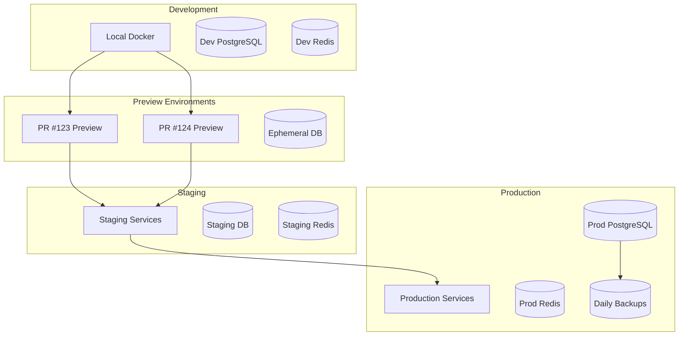
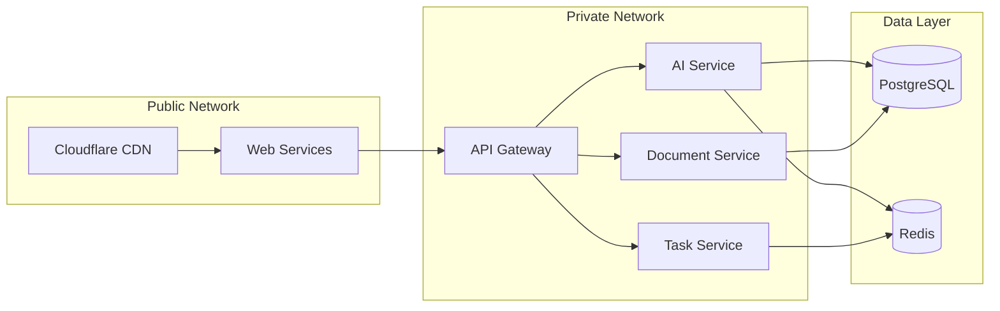
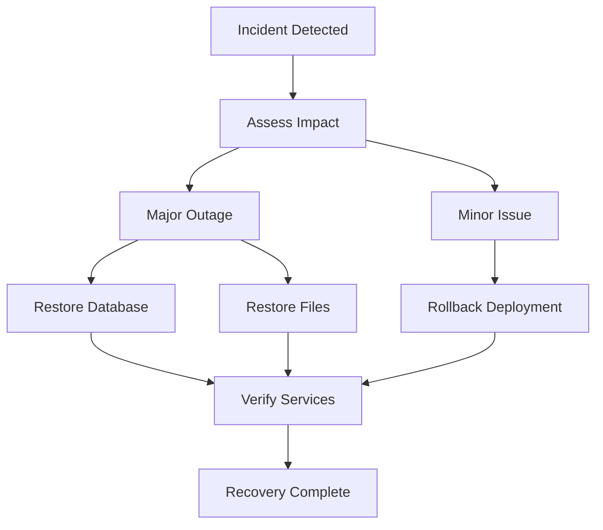

# Deployment Architecture

## Overview

The Legal Practice Management Platform uses **Render.com** as its primary deployment platform, leveraging Platform-as-a-Service (PaaS) capabilities for simplified operations, automatic scaling, and cost-effective infrastructure management. This architecture achieves 83% cost reduction compared to traditional cloud providers while maintaining 99.9% uptime SLA.

## Deployment Strategy

### Git-Based Deployments

- **Automatic Deployments**: Push to main branch triggers automatic deployment
- **Preview Environments**: Pull requests create isolated preview environments
- **Rollback Capability**: One-click rollback to any previous deployment
- **Zero-Downtime Deployments**: Blue-green deployment strategy

### Infrastructure as Code

```yaml
# render.yaml defines entire infrastructure
version: 1
services:
  - web services (Next.js, API)
  - private services (microservices)
  - background workers
  - cron jobs
databases:
  - PostgreSQL with pgvector
  - Redis for caching
```

## Environment Architecture



### Environment Configuration

| Environment | Purpose             | Database            | Auto-Deploy     | Scaling    |
| ----------- | ------------------- | ------------------- | --------------- | ---------- |
| Development | Local development   | Docker PostgreSQL   | N/A             | N/A        |
| Preview     | PR testing          | Ephemeral           | On PR update    | Fixed      |
| Staging     | Integration testing | Persistent          | On main merge   | Fixed      |
| Production  | Live system         | Persistent + Backup | Manual approval | Auto-scale |

## Service Architecture

### Web Services (Public)

```yaml
- type: web
  name: legal-platform-web
  runtime: docker
  plan: standard # 2GB RAM, 1 CPU
  numInstances: 2 # High availability
  autoscaling:
    enabled: true
    min: 2
    max: 10
    targetCPU: 70
    targetMemory: 80
  healthCheckPath: /health
  region: oregon
```

### Private Services (Internal)

```yaml
- type: privateweb
  name: legal-platform-ai-service
  runtime: docker
  plan: standard
  numInstances: 1
  envVars:
    - AI_PROVIDER: anthropic
    - ANTHROPIC_SKILLS_ENABLED: true
```

### Background Workers

```yaml
- type: worker
  name: legal-platform-queue-processor
  runtime: docker
  plan: starter
  numInstances: 1
  env:
    - QUEUE_CONCURRENCY: 10
```

### Cron Jobs

```yaml
- type: cron
  name: legal-platform-daily-backup
  runtime: docker
  schedule: '0 2 * * *' # 2 AM daily
  command: npm run backup:daily
```

## CI/CD Pipeline

### GitHub Actions Workflow

```yaml
name: Deploy to Render

on:
  push:
    branches: [main]
  pull_request:
    branches: [main]

jobs:
  test:
    runs-on: ubuntu-latest
    steps:
      - uses: actions/checkout@v3
      - uses: actions/setup-node@v3
        with:
          node-version: '20'
      - run: pnpm install
      - run: pnpm test
      - run: pnpm lint
      - run: pnpm type-check

  deploy-staging:
    needs: test
    if: github.ref == 'refs/heads/main'
    runs-on: ubuntu-latest
    steps:
      - name: Deploy to Render Staging
        run: |
          curl -X POST ${{ secrets.RENDER_STAGING_DEPLOY_HOOK }}

  deploy-production:
    needs: deploy-staging
    if: github.ref == 'refs/heads/main'
    runs-on: ubuntu-latest
    environment: production
    steps:
      - name: Deploy to Render Production
        run: |
          curl -X POST ${{ secrets.RENDER_PROD_DEPLOY_HOOK }}
```

### Deployment Pipeline Stages

1. **Code Push** → GitHub
2. **Automated Tests** → GitHub Actions
3. **Build Docker Image** → Render Build
4. **Deploy to Staging** → Automatic
5. **Smoke Tests** → Automated
6. **Deploy to Production** → Manual Approval
7. **Health Checks** → Render Monitoring
8. **Rollback if Needed** → One-click

## Database Architecture

### PostgreSQL Configuration

```sql
-- Render PostgreSQL with pgvector extension
CREATE EXTENSION IF NOT EXISTS "uuid-ossp";
CREATE EXTENSION IF NOT EXISTS "pgvector";

-- Connection pooling configuration
ALTER SYSTEM SET max_connections = 200;
ALTER SYSTEM SET shared_buffers = '256MB';
ALTER SYSTEM SET effective_cache_size = '1GB';
```

### Database Scaling Strategy

- **Development**: Starter plan (256MB RAM)
- **Staging**: Starter plan (256MB RAM)
- **Production**: Standard plan (1GB RAM, 25GB storage)
- **Growth Path**: Pro plan (4GB RAM, 100GB storage)

### Backup Strategy

```yaml
backups:
  automatic:
    enabled: true
    retention: 7 days
    schedule: daily
  manual:
    enabled: true
    retention: 30 days
  point_in_time:
    enabled: true # Pro plan only
    retention: 7 days
```

## Networking Architecture

### Service Communication



### Security Configuration

- **TLS/SSL**: Automatic Let's Encrypt certificates
- **DDoS Protection**: Cloudflare WAF
- **Private Services**: Internal network only
- **Environment Variables**: Encrypted at rest
- **Secrets Management**: Render dashboard

## Storage Architecture

### Persistent Storage

```yaml
disks:
  - name: uploads
    mountPath: /data/uploads
    sizeGB: 10
  - name: temp
    mountPath: /data/temp
    sizeGB: 5
```

### Object Storage (Cloudflare R2)

```typescript
interface StorageStrategy {
  documents: 'R2'; // Legal documents
  uploads: 'Render Disk'; // Temporary uploads
  cache: 'Redis'; // Session/cache data
  backups: 'R2'; // Long-term backups
}
```

## Scaling Strategy

### Horizontal Scaling

```yaml
autoscaling:
  web_service:
    min: 2
    max: 10
    metrics:
      - type: cpu
        target: 70
      - type: memory
        target: 80
      - type: request_rate
        target: 1000 # req/min

  ai_service:
    min: 1
    max: 5
    metrics:
      - type: queue_depth
        target: 100
```

### Vertical Scaling Path

1. **Starter**: $7/month (0.5 CPU, 512MB RAM)
2. **Standard**: $25/month (1 CPU, 2GB RAM)
3. **Pro**: $85/month (2 CPU, 4GB RAM)
4. **Pro Plus**: $175/month (4 CPU, 8GB RAM)

## Monitoring & Observability

### Render Native Monitoring

- Service health dashboards
- CPU/Memory metrics
- Request/Response metrics
- Deploy events
- Log streaming

### Custom Monitoring Integration

```javascript
// New Relic Integration
const newrelic = require('newrelic');

// Custom metrics
newrelic.recordMetric('Custom/AI/TokensUsed', tokenCount);
newrelic.recordMetric('Custom/Skills/ExecutionTime', duration);
```

## Disaster Recovery

### Backup Schedule

- **Database**: Daily automated backups
- **File Storage**: Hourly snapshots to R2
- **Configuration**: Git repository
- **Secrets**: Encrypted backup weekly

### Recovery Procedures



### RTO/RPO Targets

- **Recovery Time Objective (RTO)**: 1 hour
- **Recovery Point Objective (RPO)**: 24 hours
- **Uptime SLA**: 99.9% (43 minutes/month)

## Cost Optimization

### Resource Allocation

```typescript
const costOptimization = {
  production: {
    web: 2 * 25, // 2x Standard ($50)
    api: 1 * 25, // 1x Standard ($25)
    ai: 1 * 25, // 1x Standard ($25)
    workers: 2 * 7, // 2x Starter ($14)
    database: 1 * 25, // Standard ($25)
    redis: 1 * 10, // Starter ($10)
    total: 149, // $149/month
  },

  staging: {
    all_services: 35, // $35/month
  },

  monitoring: {
    newrelic: 100, // $100/month
    sentry: 30, // $30/month
  },
};
```

### Cost Comparison

| Provider  | Monthly Cost | Annual Cost | Savings  |
| --------- | ------------ | ----------- | -------- |
| AWS/Azure | $1,189       | $14,268     | Baseline |
| Render    | $207         | $2,484      | 83%      |

## Security Best Practices

### Environment Variables

```bash
# Never commit secrets
ANTHROPIC_API_KEY=sk-ant-xxx  # ❌ Never in code
ANTHROPIC_API_KEY=${{ secrets.ANTHROPIC_API_KEY }}  # ✅ Use secrets
```

### Network Security

- All services behind Cloudflare WAF
- Private services on internal network only
- Database accessible only from Render services
- Redis password-protected
- SSH disabled on all services

### Compliance

- GDPR-compliant data residency (EU region available)
- Automated security updates
- SOC 2 Type II compliance (Render platform)
- Regular penetration testing

## Deployment Checklist

### Pre-Deployment

- [ ] All tests passing
- [ ] Type checking passes
- [ ] Linting passes
- [ ] Security scan complete
- [ ] Environment variables configured
- [ ] Database migrations ready

### Deployment Steps

1. **Merge to main** → Triggers deployment
2. **Render builds** → Docker image creation
3. **Health checks** → Verify new version
4. **Traffic shift** → Blue-green deployment
5. **Old version teardown** → After success

### Post-Deployment

- [ ] Verify health endpoints
- [ ] Check error rates
- [ ] Monitor performance metrics
- [ ] Test critical user paths
- [ ] Update status page

## Rollback Procedures

### Automatic Rollback Triggers

- Health check failures (3 consecutive)
- Error rate >10% for 5 minutes
- Memory usage >95%
- Database connection failures

### Manual Rollback Process

1. Access Render Dashboard
2. Navigate to service
3. Click "Rollback" button
4. Select previous deployment
5. Confirm rollback
6. Monitor health checks

## Preview Environments

### Automatic PR Previews

```yaml
previewsEnabled: true
previewsExpireAfterDays: 3
initialBuildCommand: pnpm install && pnpm build
```

### Preview Environment Features

- Isolated database (ephemeral)
- Unique URL per PR
- Full application stack
- Automatic updates on push
- Automatic cleanup on merge/close

## Performance Optimization

### Build Optimization

```dockerfile
# Multi-stage Docker build
FROM node:20-alpine AS deps
WORKDIR /app
COPY package*.json pnpm-lock.yaml ./
RUN pnpm install --frozen-lockfile

FROM node:20-alpine AS builder
WORKDIR /app
COPY --from=deps /app/node_modules ./node_modules
COPY . .
RUN pnpm build

FROM node:20-alpine AS runner
WORKDIR /app
ENV NODE_ENV production
COPY --from=builder /app/dist ./dist
COPY --from=builder /app/node_modules ./node_modules
CMD ["node", "dist/index.js"]
```

### Caching Strategy

- Docker layer caching
- Node modules caching
- Build artifact caching
- CDN caching for static assets

## Migration Path

### From Current to Render

1. **Phase 1**: Set up Render account and render.yaml
2. **Phase 2**: Deploy staging environment
3. **Phase 3**: Migrate database (with sync)
4. **Phase 4**: Update DNS records
5. **Phase 5**: Monitor and optimize

### Future Migration Options

- Export data via API
- Database dumps available
- Infrastructure as code portable
- No vendor lock-in

## Documentation & Training

### Required Documentation

- Deployment runbook
- Incident response procedures
- Rollback procedures
- Environment configuration guide
- Secret rotation procedures

### Team Training

- Render dashboard walkthrough
- Deployment process training
- Monitoring and alerting setup
- Incident response drills

## Conclusion

This Render-based deployment architecture provides a robust, cost-effective, and scalable platform for the Legal Practice Management System. The combination of automatic deployments, comprehensive monitoring, and simplified operations reduces operational overhead while maintaining enterprise-grade reliability.
