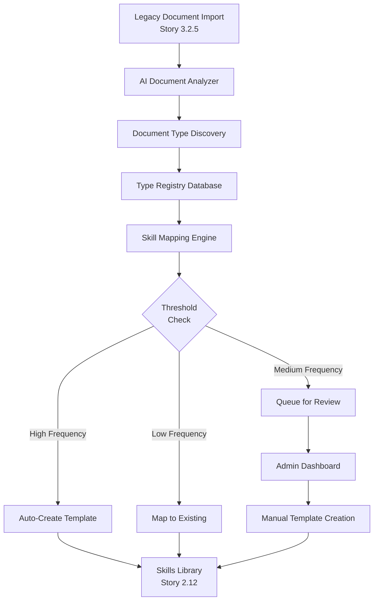
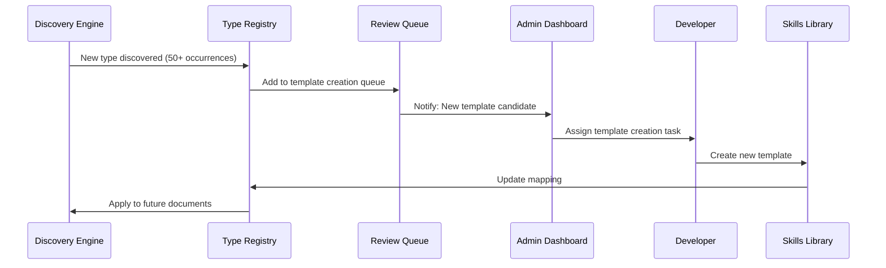

# Document Type Discovery Framework

## Bridging Skills Development (Story 2.12) with Legacy Import (Story 3.2.6)

---

## Executive Summary

This framework defines how the Bojin Law platform progressively discovers, categorizes, and creates skills for document types based on actual usage patterns from legacy document imports. Rather than predefining all possible document types, the system learns from real data and adapts its capabilities accordingly.

**Core Principle:** _Build what's needed, when it's needed, based on actual usage data._

---

## 1. Architecture Overview



---

## 2. Document Type Registry Schema

```sql
-- Core discovery tracking table
CREATE TABLE document_type_registry (
    id UUID PRIMARY KEY DEFAULT uuid_generate_v4(),

    -- Discovery Information
    discovered_type_original VARCHAR(500) NOT NULL, -- e.g., "Contract de Vanzare-Cumparare"
    discovered_type_normalized VARCHAR(255) NOT NULL, -- e.g., "contract_vanzare_cumparare"
    discovered_type_english VARCHAR(500), -- e.g., "Sales Purchase Agreement"

    -- Language & Classification
    primary_language VARCHAR(10) NOT NULL, -- 'ro', 'en', 'mixed'
    document_category VARCHAR(100), -- 'contract', 'notice', 'filing', 'correspondence'

    -- Mapping Information
    mapped_skill_id VARCHAR(100), -- e.g., 'contract-analysis'
    mapped_template_id UUID REFERENCES template_library(id),
    mapping_confidence DECIMAL(3,2), -- 0.00 to 1.00
    mapping_status VARCHAR(50) DEFAULT 'pending', -- 'pending', 'auto_mapped', 'manual_mapped', 'template_created'

    -- Usage Metrics
    first_seen_date TIMESTAMPTZ NOT NULL DEFAULT CURRENT_TIMESTAMP,
    last_seen_date TIMESTAMPTZ NOT NULL DEFAULT CURRENT_TIMESTAMP,
    total_occurrences INTEGER DEFAULT 1,
    unique_variations INTEGER DEFAULT 1,
    avg_document_length INTEGER,

    -- Decision Metrics
    frequency_score DECIMAL(3,2), -- Based on occurrence rate
    complexity_score DECIMAL(3,2), -- From AI analysis
    business_value_score DECIMAL(3,2), -- Manual or calculated
    priority_score DECIMAL(3,2), -- Composite score for action priority

    -- Metadata
    sample_document_ids UUID[], -- Keep 3-5 examples
    common_clauses JSONB, -- Most frequent clause types found
    typical_structure JSONB, -- Common sections/headers

    -- Audit
    created_at TIMESTAMPTZ NOT NULL DEFAULT CURRENT_TIMESTAMP,
    updated_at TIMESTAMPTZ NOT NULL DEFAULT CURRENT_TIMESTAMP,
    reviewed_by VARCHAR(255),
    reviewed_at TIMESTAMPTZ,

    UNIQUE(discovered_type_normalized, primary_language)
);

-- Indexes for performance
CREATE INDEX idx_registry_type ON document_type_registry(discovered_type_normalized);
CREATE INDEX idx_registry_status ON document_type_registry(mapping_status);
CREATE INDEX idx_registry_priority ON document_type_registry(priority_score DESC);
CREATE INDEX idx_registry_occurrences ON document_type_registry(total_occurrences DESC);

-- Track individual document mappings
CREATE TABLE document_type_instances (
    id UUID PRIMARY KEY DEFAULT uuid_generate_v4(),
    document_id UUID NOT NULL REFERENCES training_documents(id),
    registry_id UUID NOT NULL REFERENCES document_type_registry(id),
    confidence_score DECIMAL(3,2),
    detected_at TIMESTAMPTZ NOT NULL DEFAULT CURRENT_TIMESTAMP
);
```

---

## 3. Discovery Pipeline Integration

### 3.1 During Legacy Import (Story 3.2.5)

```typescript
// In ai-document-analyzer.ts
interface DocumentTypeDiscovery {
  async discoverAndRegister(
    document: ExtractedDocument,
    aiAnalysis: AIAnalysisResult
  ): Promise<RegistryEntry> {

    // 1. Normalize the discovered type
    const normalizedType = this.normalizeTypeName(aiAnalysis.documentType);

    // 2. Check if type exists in registry
    const existing = await this.findInRegistry(normalizedType);

    if (existing) {
      // 3a. Update existing entry
      await this.updateRegistryEntry(existing, {
        occurrences: existing.totalOccurrences + 1,
        lastSeen: new Date(),
        samples: this.updateSampleDocuments(existing.sampleDocumentIds, document.id)
      });
      return existing;
    } else {
      // 3b. Create new registry entry
      return await this.createRegistryEntry({
        discoveredType: aiAnalysis.documentType,
        normalizedType,
        language: aiAnalysis.primaryLanguage,
        category: this.inferCategory(aiAnalysis),
        firstDocument: document.id,
        clauses: aiAnalysis.clauseCategories
      });
    }
  }
}
```

### 3.2 During Training Pipeline (Story 3.2.6)

```typescript
// Enhanced pattern analysis with type discovery
async function analyzePatternsByType(category: string) {
  // Group documents by discovered type
  const typeGroups = await prisma.documentTypeRegistry.findMany({
    where: {
      document_category: category,
      mapping_status: 'pending',
    },
    orderBy: { total_occurrences: 'desc' },
  });

  for (const typeGroup of typeGroups) {
    // Analyze if this type needs its own template
    const decision = await this.evaluateTemplateNeed(typeGroup);

    if (decision.action === 'create_template') {
      await this.queueTemplateCreation(typeGroup);
    } else if (decision.action === 'map_existing') {
      await this.mapToExistingSkill(typeGroup, decision.targetSkill);
    }
  }
}
```

---

## 4. Automated Decision Rules

### 4.1 Threshold Configuration

```yaml
# config/discovery-thresholds.yml
template_creation:
  auto_create:
    min_occurrences: 50
    min_frequency_score: 0.75
    min_business_value: 0.70
    min_confidence: 0.85

  queue_for_review:
    min_occurrences: 20
    min_frequency_score: 0.50
    min_business_value: 0.50
    min_confidence: 0.70

  map_to_existing:
    max_occurrences: 19
    similarity_threshold: 0.80

priority_weights:
  frequency: 0.35
  complexity: 0.20
  business_value: 0.30
  recency: 0.15
```

### 4.2 Decision Engine

```typescript
class TemplateDecisionEngine {
  async evaluateDocumentType(registry: DocumentTypeRegistry): Promise<DecisionResult> {
    // Calculate composite priority score
    const priority = this.calculatePriority(registry);

    // Check thresholds
    if (this.meetsAutoCreateThreshold(registry, priority)) {
      return {
        action: 'create_template',
        priority: 'high',
        skill: this.determineTargetSkill(registry),
        estimatedEffort: this.estimateTemplateEffort(registry),
      };
    }

    // Try to map to existing template
    const mapping = await this.findBestMapping(registry);
    if (mapping.confidence > 0.8) {
      return {
        action: 'map_existing',
        targetTemplate: mapping.templateId,
        confidence: mapping.confidence,
      };
    }

    // Queue for human review
    if (this.meetsReviewThreshold(registry, priority)) {
      return {
        action: 'queue_review',
        priority: 'medium',
        suggestedSkill: this.suggestSkill(registry),
        reason: this.generateReviewReason(registry),
      };
    }

    // Low priority - map to generic
    return {
      action: 'map_generic',
      priority: 'low',
    };
  }
}
```

---

## 5. Skill Mapping Rules

### 5.1 Category to Skill Mapping

```javascript
const CATEGORY_SKILL_MAP = {
  // Contracts & Agreements
  contract: 'contract-analysis',
  agreement: 'contract-analysis',
  protocol: 'contract-analysis',

  // Document Creation
  template: 'document-drafting',
  draft: 'document-drafting',
  form: 'document-drafting',

  // Legal Proceedings
  notice: 'document-drafting',
  intampinare: 'document-drafting',
  contestatie: 'document-drafting',
  cerere: 'document-drafting',

  // Research & Analysis
  opinion: 'legal-research',
  memorandum: 'legal-research',
  analysis: 'legal-research',

  // Compliance
  gdpr: 'compliance-check',
  audit: 'compliance-check',
  regulatory: 'compliance-check',
};
```

### 5.2 Romanian Legal Document Mapping

```javascript
const ROMANIAN_DOCUMENT_TYPES = {
  // Contracts (→ Contract Analysis)
  'contract de vanzare-cumparare': {
    skill: 'contract-analysis',
    template: 'purchase_agreement',
    priority: 'high',
  },
  'contract de prestari servicii': {
    skill: 'contract-analysis',
    template: 'service_agreement',
    priority: 'high',
  },
  'contract de inchiriere': {
    skill: 'contract-analysis',
    template: 'lease_agreement',
    priority: 'medium',
  },

  // Legal Notices (→ Document Drafting)
  'notificare avocateasca': {
    skill: 'document-drafting',
    template: null, // Needs creation
    priority: 'high',
  },
  'somatie de plata': {
    skill: 'document-drafting',
    template: null, // Needs creation
    priority: 'high',
  },

  // Court Documents (→ Document Drafting)
  intampinare: {
    skill: 'document-drafting',
    template: null, // Needs creation
    priority: 'high',
  },
  'cerere de chemare in judecata': {
    skill: 'document-drafting',
    template: null, // Needs creation
    priority: 'medium',
  },
  contestatie: {
    skill: 'document-drafting',
    template: null, // Needs creation
    priority: 'medium',
  },
};
```

---

## 6. Feedback Loop Mechanism

### 6.1 Template Creation Workflow



### 6.2 Continuous Improvement Process

```typescript
class FeedbackLoopManager {
  // Weekly analysis job
  async analyzeWeeklyPatterns() {
    const report = {
      newTypesDiscovered: [],
      templatesCreated: [],
      mappingAccuracy: 0,
      recommendations: [],
    };

    // 1. Check for emerging document types
    const emergingTypes = await this.findEmergingTypes({
      minOccurrences: 10,
      timeWindow: '7 days',
    });

    // 2. Evaluate mapping accuracy
    const mappingMetrics = await this.evaluateMappingAccuracy();

    // 3. Generate recommendations
    if (emergingTypes.length > 0) {
      report.recommendations.push({
        type: 'template_creation',
        items: emergingTypes,
        estimatedValue: this.calculateBusinessValue(emergingTypes),
      });
    }

    // 4. Send to stakeholders
    await this.sendWeeklyReport(report);
  }

  // Template effectiveness tracking
  async trackTemplateUsage() {
    return prisma.$queryRaw`
      SELECT
        dt.discovered_type_original,
        dt.mapped_template_id,
        COUNT(*) as usage_count,
        AVG(confidence_score) as avg_confidence,
        COUNT(DISTINCT document_id) as unique_docs
      FROM document_type_registry dt
      JOIN document_type_instances dti ON dt.id = dti.registry_id
      WHERE dt.mapping_status = 'template_created'
        AND dti.detected_at >= NOW() - INTERVAL '30 days'
      GROUP BY dt.discovered_type_original, dt.mapped_template_id
      ORDER BY usage_count DESC
    `;
  }
}
```

---

## 7. Implementation Timeline

### Phase 1: Foundation (Week 1)

- [ ] Create document_type_registry table
- [ ] Update AI Document Analyzer to populate registry
- [ ] Build basic mapping engine
- [ ] Set up initial threshold configuration

### Phase 2: Automation (Week 2)

- [ ] Implement decision engine
- [ ] Create auto-mapping for high-confidence matches
- [ ] Build review queue system
- [ ] Add admin dashboard views

### Phase 3: Feedback Loop (Week 3)

- [ ] Set up weekly analysis jobs
- [ ] Create template effectiveness tracking
- [ ] Build recommendation engine
- [ ] Implement continuous improvement metrics

### Phase 4: Romanian Specialization (Week 4)

- [ ] Map common Romanian document types
- [ ] Create first 3 Romanian-specific templates
- [ ] Add bilingual support to templates
- [ ] Test with production data

---

## 8. Monitoring & KPIs

### 8.1 Discovery Metrics

```sql
-- Dashboard query for document type discovery
CREATE VIEW document_discovery_metrics AS
SELECT
    DATE_TRUNC('week', first_seen_date) as week,
    COUNT(*) as new_types_discovered,
    SUM(total_occurrences) as total_documents,
    AVG(mapping_confidence) as avg_confidence,
    COUNT(CASE WHEN mapping_status = 'template_created' THEN 1 END) as templates_created,
    COUNT(CASE WHEN mapping_status = 'pending' THEN 1 END) as pending_review
FROM document_type_registry
GROUP BY DATE_TRUNC('week', first_seen_date)
ORDER BY week DESC;
```

### 8.2 Success Indicators

| Metric                     | Target  | Measurement                                  |
| -------------------------- | ------- | -------------------------------------------- |
| **Discovery Coverage**     | >95%    | Documents successfully categorized           |
| **Auto-Mapping Rate**      | >70%    | Documents mapped without manual intervention |
| **Template Creation Time** | <3 days | From discovery to template availability      |
| **Mapping Accuracy**       | >85%    | Confidence score for automated mappings      |
| **Template Utilization**   | >60%    | Templates used vs. generic processing        |

---

## 9. API Endpoints

### Discovery Status API

```typescript
// GET /api/admin/document-types/discovery-status
{
  "summary": {
    "totalTypesDiscovered": 47,
    "templatesCreated": 12,
    "pendingReview": 8,
    "autoMapped": 27
  },
  "recentDiscoveries": [
    {
      "type": "Notificare Avocateasca",
      "occurrences": 89,
      "firstSeen": "2024-11-15",
      "status": "pending_review",
      "priority": 0.82
    }
  ],
  "recommendations": [
    {
      "action": "create_template",
      "documentType": "Intampinare",
      "reason": "High frequency (67 occurrences) with no existing template",
      "estimatedROI": "15 hours saved per month"
    }
  ]
}
```

### Manual Mapping API

```typescript
// POST /api/admin/document-types/{registryId}/map
{
  "targetSkill": "document-drafting",
  "templateId": "uuid-of-template", // optional
  "confidence": 0.95,
  "notes": "Manually verified - similar to existing response template"
}
```

---

## 10. Business Value Calculation

```typescript
class BusinessValueCalculator {
  calculateTemplateROI(registry: DocumentTypeRegistry): ROIEstimate {
    const metrics = {
      // Time saved per document (minutes)
      timeSavedPerDoc: registry.avg_document_length > 1000 ? 30 : 15,

      // Expected monthly volume
      monthlyVolume: registry.total_occurrences * 4, // Extrapolate

      // Lawyer hourly rate (EUR)
      hourlyRate: 150,

      // Template creation cost (hours)
      templateCreationHours: this.estimateCreationEffort(registry),
    };

    const monthlySavings =
      (metrics.timeSavedPerDoc / 60) * metrics.monthlyVolume * metrics.hourlyRate;

    const creationCost = metrics.templateCreationHours * metrics.hourlyRate;

    return {
      monthlySavingsEUR: monthlySavings,
      creationCostEUR: creationCost,
      paybackPeriodDays: (creationCost / monthlySavings) * 30,
      twelveMonthROI: (monthlySavings * 12 - creationCost) / creationCost,
    };
  }
}
```

---

## 11. Integration Points

### With Story 2.12 (Skills Development)

- Registry feeds template creation backlog
- Skills updated based on discovery patterns
- Performance metrics feedback to skill optimization

### With Story 3.2.5 (Legacy Import)

- Real-time type discovery during import
- Metadata extraction for registry population
- Sample document collection

### With Story 3.2.6 (AI Training Pipeline)

- Pattern analysis by document type
- Template extraction from similar documents
- Continuous learning from processed documents

---

## 12. Future Enhancements

1. **Machine Learning Classification**
   - Train custom classifier on discovered types
   - Improve auto-mapping confidence
   - Predict template needs

2. **Multi-Jurisdiction Support**
   - Detect jurisdiction from document content
   - Create jurisdiction-specific variants
   - Compliance rule mapping

3. **Template Generation AI**
   - Auto-generate draft templates from patterns
   - Suggest clause variations
   - Learn firm-specific language

4. **Client-Specific Customization**
   - Track document types by client
   - Create client-specific templates
   - Personalized suggestions

---

## Appendix A: Sample Implementation Code

```typescript
// Complete implementation example
import { PrismaClient } from '@prisma/client';
import { DocumentTypeDiscoveryService } from './services/discovery';

const prisma = new PrismaClient();

export class DocumentTypeFramework {
  private discovery: DocumentTypeDiscoveryService;

  async processDocument(document: ExtractedDocument, aiAnalysis: AIAnalysisResult): Promise<void> {
    // 1. Discover and register type
    const registry = await this.discovery.discoverAndRegister(document, aiAnalysis);

    // 2. Evaluate if action needed
    if (registry.total_occurrences % 10 === 0) {
      await this.evaluateTypeForAction(registry);
    }

    // 3. Update metrics
    await this.updateDiscoveryMetrics(registry);
  }

  private async evaluateTypeForAction(registry: DocumentTypeRegistry): Promise<void> {
    const decision = await this.decisionEngine.evaluate(registry);

    switch (decision.action) {
      case 'create_template':
        await this.queueTemplateCreation(registry, decision);
        break;
      case 'map_existing':
        await this.mapToExistingTemplate(registry, decision);
        break;
      case 'queue_review':
        await this.addToReviewQueue(registry, decision);
        break;
    }
  }
}
```

---

**Document Version:** 1.0.0
**Created:** 2024-11-19
**Author:** Mary (Business Analyst)
**Status:** Ready for Implementation Review
