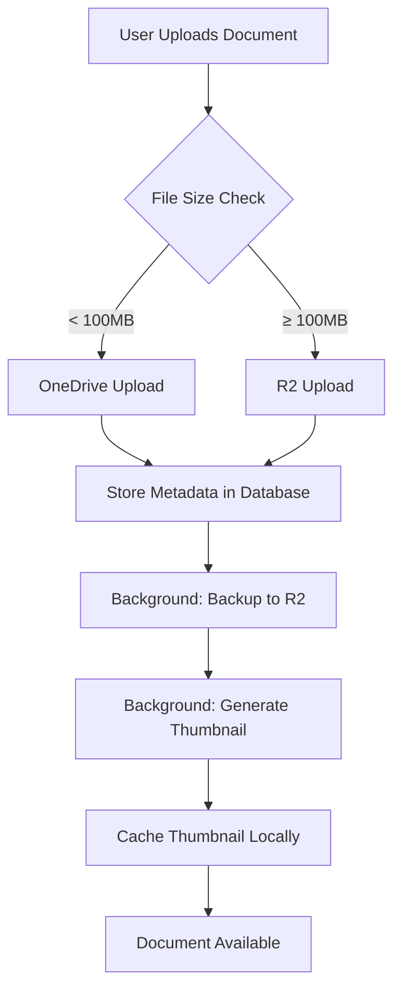

# External APIs

## Microsoft Graph API

- **Purpose:** Core integration for Microsoft 365 services including Outlook email, Calendar, OneDrive file storage, and Azure AD authentication
- **Documentation:** https://docs.microsoft.com/en-us/graph/
- **Base URL(s):** https://graph.microsoft.com/v1.0
- **Authentication:** OAuth 2.0 with application and delegated permissions
- **Rate Limits:** 10,000 requests per 10 minutes per app

**Key Endpoints Used:**

- `GET /me` - Get current user profile
- `GET /users/{id}` - Retrieve user information
- `GET/POST /me/messages` - Read and send emails
- `POST /subscriptions` - Create webhooks for email changes
- `GET/PUT /drives/{drive-id}/items/{item-id}` - OneDrive file operations

## Anthropic Claude API (PRIMARY PROVIDER)

- **Status:** PRIMARY - All AI operations use Claude by default
- **Purpose:** Primary LLM provider for document generation, legal analysis, natural language processing
- **Documentation:** https://docs.anthropic.com/claude/reference/
- **Base URL(s):** https://api.anthropic.com/v1
- **Authentication:** API key in X-API-Key header
- **Rate Limits:**
  - Claude 3 Haiku: 1000 requests/min, 100K tokens/min
  - Claude 3.5 Sonnet: 200 requests/min, 40K tokens/min
  - Claude 3 Opus: 50 requests/min, 10K tokens/min

**Key Features:**

- **Skills API (Beta):** 70% token reduction for repetitive tasks
- **Prompt Caching:** 90% cost reduction on cached content
- **Batch API:** 50% discount for non-urgent requests
- **200K Context Window:** Handles large legal documents

**Key Endpoints:**

- `POST /messages` - Send messages with optional skills
- `POST /messages/batch` - Batch processing for cost optimization
- `POST /skills/upload` - Upload custom legal skills
- `POST /skills/execute` - Execute specific skills

## Claude Skills API (BETA)

- **Purpose:** Specialized tools for 70% token reduction on legal workflows
- **Documentation:** https://docs.anthropic.com/claude/skills
- **Base URL(s):** https://api.anthropic.com/v1/skills
- **Authentication:** Same as Claude API with beta flag enabled
- **Available Skills:**
  - Contract Analysis - Extract terms, identify risks
  - Document Drafting - Generate from templates
  - Legal Research - Search case law and statutes
  - Compliance Check - Validate against regulations

## xAI Grok API (FALLBACK PROVIDER)

- **Status:** FALLBACK - Used when Claude is unavailable
- **Purpose:** Backup LLM provider for general queries and real-time information
- **Documentation:** https://docs.x.ai/api
- **Base URL(s):** https://api.x.ai/v1
- **Authentication:** API key in Authorization header
- **Rate Limits:** 100 requests/min, 20K tokens/min
- **Key Features:** Access to real-time X (Twitter) data

**Key Endpoints:**

- `POST /chat/completions` - Generate text responses
- `GET /models` - List available models

## Voyage AI API (Embeddings)

- **Purpose:** High-quality embeddings for semantic search and document similarity
- **Documentation:** https://docs.voyageai.com/
- **Base URL(s):** https://api.voyageai.com/v1
- **Authentication:** Bearer token with API key
- **Rate Limits:** 300 requests/min
- **Models Used:** voyage-large-2 (best quality for legal documents)

**Key Endpoints:**

- `POST /embeddings` - Generate embeddings for text

## OpenAI API (DEPRECATED)

- **Status:** DEPRECATED - Do not use for new features
- **Purpose:** Legacy support only, migrating to Claude/Grok
- **Migration:** All OpenAI calls should be replaced with Claude API
- **Sunset Date:** Q2 2026
- **Documentation:** https://platform.openai.com/docs/api-reference
- **Note:** 40% more expensive than Claude for comparable performance

## Document Storage Architecture (Story 2.2)

The Legal Platform uses a hybrid storage strategy with Microsoft OneDrive as the primary storage and Cloudflare R2 as fallback/backup storage.

### Storage Providers

#### Microsoft OneDrive (PRIMARY)

- **Purpose:** Primary document storage with native Microsoft 365 integration
- **API:** Microsoft Graph API `/drives` endpoints
- **Authentication:** OAuth 2.0 with delegated permissions
- **Advantages:**
  - Native integration with Office 365 apps (Word, Excel, Outlook)
  - Built-in versioning and change tracking
  - Collaboration features (co-authoring, comments, sharing)
  - Included in Microsoft 365 license (no additional storage cost)
  - Users can access documents via Office 365 web/mobile apps
- **Limitations:**
  - Requires Microsoft Graph API authentication
  - Rate limits: 10,000 requests per 10 minutes
  - Dependent on Microsoft 365 availability
  - Large file uploads (>100MB) may be throttled

**OneDrive Folder Structure:**

```
/Cases/{CaseID}/
├── Documents/
│   ├── Pleadings/
│   ├── Correspondence/
│   ├── Evidence/
│   └── Templates/
├── Discovery/
└── Court_Filings/
```

**Key Endpoints:**

- `GET /drives/{drive-id}/root/children` - List root folder contents
- `POST /drives/{drive-id}/root:/Cases/{CaseID}/Documents:/children` - Create folder
- `PUT /drives/{drive-id}/items/{item-id}/content` - Upload document
- `GET /drives/{drive-id}/items/{item-id}/content` - Download document
- `GET /drives/{drive-id}/items/{item-id}/versions` - Get version history
- `POST /drives/{drive-id}/items/{item-id}/createLink` - Create sharing link

#### Cloudflare R2 (FALLBACK/BACKUP)

- **Purpose:** Cost-effective fallback storage and public document hosting
- **API:** S3-compatible API (use AWS SDK with custom endpoint)
- **Authentication:** Access Key ID + Secret Access Key
- **Cost:** $0.015/GB storage, **$0/GB egress** (zero bandwidth charges)
- **Advantages:**
  - Zero egress fees (major cost savings vs S3)
  - S3-compatible API (easy migration)
  - Global CDN for fast delivery
  - Suitable for large files (>100MB)
  - Public document hosting (filed court documents)
  - Backup of OneDrive documents
- **Limitations:**
  - No built-in collaboration features
  - Requires separate access management
  - No native Office integration

**R2 Folder Structure:**

```
legal-platform-documents/
├── cases/
│   └── {CaseID}/
│       ├── documents/
│       ├── evidence/
│       └── court-filings/
├── templates/
└── public/
    └── court-filings/ (publicly accessible)
```

**Configuration:**

```typescript
import { S3Client, PutObjectCommand } from '@aws-sdk/client-s3';

const r2Client = new S3Client({
  region: 'auto',
  endpoint: `https://${process.env.CLOUDFLARE_R2_ACCOUNT_ID}.r2.cloudflarestorage.com`,
  credentials: {
    accessKeyId: process.env.CLOUDFLARE_R2_ACCESS_KEY_ID,
    secretAccessKey: process.env.CLOUDFLARE_R2_SECRET_ACCESS_KEY,
  },
});
```

### Document Storage Decision Matrix

| Scenario                            | Primary Storage | Fallback Storage | Rationale                                   |
| ----------------------------------- | --------------- | ---------------- | ------------------------------------------- |
| User uploads document via web app   | OneDrive        | R2 (backup)      | Microsoft 365 integration, collaboration    |
| AI generates document from template | OneDrive        | R2 (backup)      | User can edit in Office apps                |
| Large files >100MB                  | R2              | OneDrive         | OneDrive throttles, R2 has no egress fees   |
| Public documents (filed pleadings)  | R2 Public       | OneDrive         | Global CDN, no auth required, fast delivery |
| Document thumbnails/previews        | Local Cache     | R2               | Fast access, auto-generated                 |
| Archived cases (>2 years old)       | R2              | OneDrive         | Cost-effective long-term storage            |
| Users without Microsoft 365 access  | R2              | N/A              | Alternative for non-M365 users              |

### Storage Selection Logic

```typescript
async function getStorageProvider(context: StorageContext): Promise<'onedrive' | 'r2'> {
  // Large files > 100MB go to R2
  if (context.fileSize > 100 * 1024 * 1024) {
    return 'r2';
  }

  // Public documents go to R2
  if (context.isPublic) {
    return 'r2';
  }

  // Archived cases go to R2
  if (context.caseArchived) {
    return 'r2';
  }

  // Users without M365 access go to R2
  if (!context.userHasM365) {
    return 'r2';
  }

  // Default: OneDrive for collaboration
  return 'onedrive';
}
```

### Document Upload Workflow



### Environment Variables

```bash
# OneDrive (Microsoft Graph)
ONEDRIVE_CLIENT_ID=<azure-app-client-id>
ONEDRIVE_CLIENT_SECRET=<azure-app-secret>
ONEDRIVE_TENANT_ID=<azure-tenant-id>

# Cloudflare R2
CLOUDFLARE_R2_ACCOUNT_ID=<account-id>
CLOUDFLARE_R2_ACCESS_KEY_ID=<access-key>
CLOUDFLARE_R2_SECRET_ACCESS_KEY=<secret-key>
STORAGE_BUCKET=legal-platform-documents

# Storage Provider Selection
STORAGE_PROVIDER=onedrive  # onedrive | r2 | local (for development)
STORAGE_BACKUP_ENABLED=true # Backup to R2 when using OneDrive
```

### Rate Limits and Performance

| Provider | Upload Rate Limit | Download Rate Limit | Latency (p95) | Bandwidth Cost |
| -------- | ----------------- | ------------------- | ------------- | -------------- |
| OneDrive | 10K req/10min     | 10K req/10min       | 200-500ms     | Included       |
| R2       | Unlimited\*       | Unlimited\*         | 50-150ms      | $0/GB          |

\*Subject to Cloudflare account limits

### Security Considerations

1. **Authentication:**
   - OneDrive: OAuth 2.0 with user consent
   - R2: Pre-signed URLs with time-limited access

2. **Encryption:**
   - OneDrive: At-rest encryption (Microsoft-managed keys)
   - R2: At-rest encryption (AES-256)

3. **Access Control:**
   - OneDrive: Per-file sharing permissions
   - R2: Bucket policies + pre-signed URLs

4. **Audit Logging:**
   - All uploads/downloads logged to database
   - User, timestamp, document ID tracked

[Additional external APIs continue...]
