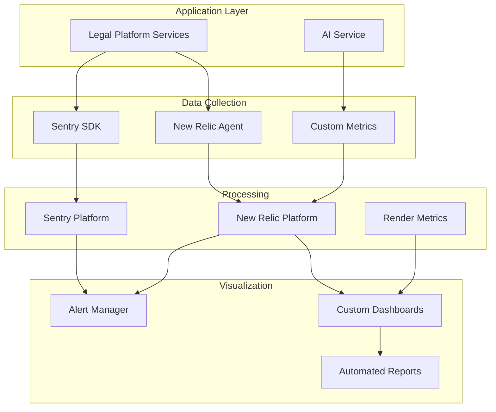

# Monitoring and Observability

## Monitoring Stack

### Primary Monitoring

- **Application Performance Monitoring (APM):** New Relic APM for comprehensive application monitoring
- **Infrastructure Monitoring:** Render Native Metrics + New Relic Infrastructure
- **Error Tracking:** Sentry for detailed error tracking and debugging
- **Log Management:** New Relic Logs + Winston structured logging
- **Synthetic Monitoring:** New Relic Synthetics for uptime monitoring

### AI-Specific Monitoring

- **Claude API Monitoring:** Custom metrics for token usage, skills effectiveness, and cost tracking
- **Grok API Monitoring:** Fallback usage tracking and performance metrics
- **Skills Performance:** Dedicated dashboard for Skills API metrics

## Architecture Overview



## Key Metrics

### Frontend Metrics

| Metric                  | Target | Alert Threshold | Collection Method |
| ----------------------- | ------ | --------------- | ----------------- |
| Core Web Vitals (LCP)   | <2.5s  | >4s             | New Relic Browser |
| First Input Delay (FID) | <100ms | >300ms          | New Relic Browser |
| Cumulative Layout Shift | <0.1   | >0.25           | New Relic Browser |
| JavaScript Error Rate   | <1%    | >5%             | Sentry            |
| API Response Time (p95) | <500ms | >2000ms         | New Relic APM     |
| Page Load Time          | <3s    | >5s             | New Relic Browser |

### Backend Metrics

| Metric              | Target | Alert Threshold | Collection Method  |
| ------------------- | ------ | --------------- | ------------------ |
| Request Rate        | N/A    | >10K/min        | New Relic APM      |
| Error Rate          | <0.5%  | >2%             | New Relic APM      |
| Response Time (p50) | <200ms | >500ms          | New Relic APM      |
| Response Time (p99) | <2s    | >5s             | New Relic APM      |
| Database Query Time | <100ms | >500ms          | New Relic Database |
| Redis Hit Rate      | >90%   | <80%            | Custom Metrics     |

### AI Service Metrics

| Metric                   | Target | Alert Threshold | Collection Method |
| ------------------------ | ------ | --------------- | ----------------- |
| Claude API Success Rate  | >99%   | <95%            | Custom Metrics    |
| Skills Token Reduction   | >70%   | <60%            | Custom Metrics    |
| Average AI Response Time | <5s    | >10s            | New Relic APM     |
| Cost per Request         | <$0.02 | >$0.05          | Custom Metrics    |
| Fallback to Grok Rate    | <5%    | >15%            | Custom Metrics    |
| Prompt Cache Hit Rate    | >40%   | <25%            | Custom Metrics    |

### Infrastructure Metrics (Render)

| Metric          | Target | Alert Threshold | Collection Method |
| --------------- | ------ | --------------- | ----------------- |
| Service Health  | 100%   | <100%           | Render Native     |
| CPU Usage       | <70%   | >85%            | Render Metrics    |
| Memory Usage    | <80%   | >90%            | Render Metrics    |
| Disk I/O        | <70%   | >85%            | Render Metrics    |
| Network Latency | <50ms  | >200ms          | Render Metrics    |

### Business Metrics

| Metric                  | Target | Alert Threshold | Collection Method |
| ----------------------- | ------ | --------------- | ----------------- |
| Daily Active Users      | Growth | <90% of average | Custom Events     |
| Documents Created/Day   | >100   | <50             | Custom Events     |
| AI Feature Usage Rate   | >60%   | <40%            | Custom Events     |
| Time Saved (hours/user) | >2     | <1.5            | Calculated Metric |
| Case Completion Time    | -20%   | +10%            | Custom Events     |

## Logging Strategy

### Log Levels and Usage

```typescript
enum LogLevel {
  ERROR = 0, // System errors, exceptions
  WARN = 1, // Degraded performance, fallbacks
  INFO = 2, // Normal operations, state changes
  DEBUG = 3, // Detailed debugging information
  TRACE = 4, // Very detailed tracing
}
```

### Structured Logging Format

```json
{
  "timestamp": "2024-01-15T10:30:45.123Z",
  "level": "INFO",
  "service": "ai-service",
  "traceId": "abc123def456",
  "userId": "user_789",
  "message": "AI request processed successfully",
  "metadata": {
    "provider": "claude",
    "model": "sonnet-3.5",
    "tokens": 1250,
    "duration_ms": 3500,
    "skill_used": "contract-analysis"
  }
}
```

### Log Aggregation Pipeline

1. **Collection**: Winston writes to stdout/stderr
2. **Shipping**: Render collects and forwards to New Relic
3. **Processing**: New Relic Logs ingests and indexes
4. **Analysis**: Custom parsing rules extract metrics
5. **Alerting**: Threshold-based alerts on patterns

## Custom Dashboards

### Executive Dashboard

- Total users and growth trend
- Documents processed today/week/month
- AI cost savings achieved
- System health score
- Active cases and completion rates

### Operations Dashboard

- Service health matrix
- Error rates by service
- Response time heatmap
- Database performance
- Queue depths and processing rates

### AI Performance Dashboard

- Token usage by model
- Skills effectiveness scores
- Cost per operation trends
- Cache hit rates
- Fallback frequency
- Model selection distribution

### Security Dashboard

- Failed authentication attempts
- API rate limit violations
- Suspicious activity patterns
- Data access audit trail
- Compliance check status

## Alerting Rules

### Critical Alerts (Immediate Page)

```yaml
- name: Service Down
  condition: service.health == 0
  duration: 1 minute
  action: page_oncall

- name: Database Connection Lost
  condition: db.connections == 0
  duration: 30 seconds
  action: page_oncall

- name: High Error Rate
  condition: error_rate > 5%
  duration: 5 minutes
  action: page_oncall
```

### Warning Alerts (Slack/Email)

```yaml
- name: Elevated Response Time
  condition: p95_response_time > 2s
  duration: 10 minutes
  action: notify_slack

- name: Low Cache Hit Rate
  condition: cache_hit_rate < 30%
  duration: 15 minutes
  action: notify_email

- name: High AI Costs
  condition: daily_ai_cost > $100
  duration: immediate
  action: notify_slack
```

### Info Alerts (Dashboard Only)

```yaml
- name: Deployment Complete
  condition: deployment.status == success
  action: update_dashboard

- name: Backup Complete
  condition: backup.status == success
  action: log_event
```

## Performance Budgets

### Frontend Performance Budget

```javascript
const performanceBudget = {
  // Bundle sizes
  javascript: {
    main: 200_000, // 200KB
    vendor: 300_000, // 300KB
    total: 500_000, // 500KB
  },

  // Load metrics
  metrics: {
    FCP: 1500, // First Contentful Paint
    LCP: 2500, // Largest Contentful Paint
    TTI: 3500, // Time to Interactive
    TBT: 300, // Total Blocking Time
  },

  // Resource counts
  resources: {
    images: 20,
    fonts: 5,
    scripts: 10,
    stylesheets: 5,
  },
};
```

### Backend Performance Budget

```typescript
interface PerformanceBudget {
  api: {
    p50: 200; // ms
    p95: 1000; // ms
    p99: 2000; // ms
  };

  database: {
    simpleQuery: 50; // ms
    complexQuery: 200; // ms
    transaction: 500; // ms
  };

  ai: {
    simpleRequest: 2000; // ms
    skillExecution: 5000; // ms
    batchProcess: 30000; // ms
  };
}
```

## Distributed Tracing

### Trace Context Propagation

```typescript
class TraceContext {
  traceId: string;
  spanId: string;
  parentSpanId?: string;
  baggage: Map<string, string>;

  // Propagate through HTTP headers
  toHeaders(): Record<string, string> {
    return {
      'X-Trace-Id': this.traceId,
      'X-Span-Id': this.spanId,
      'X-Parent-Span-Id': this.parentSpanId || '',
      'X-Trace-Baggage': this.serializeBaggage(),
    };
  }
}
```

### Service Instrumentation

```typescript
// Automatic instrumentation with New Relic
import newrelic from 'newrelic';

// Manual instrumentation for custom operations
async function processDocument(doc: Document) {
  const segment = newrelic.startSegment('document.process', true, () => {
    // Process document
    return processedDoc;
  });

  return segment;
}
```

## Synthetic Monitoring

### Critical User Journeys

1. **Login Flow**: Every 5 minutes
2. **Document Creation**: Every 15 minutes
3. **AI Query**: Every 10 minutes
4. **Case Search**: Every 30 minutes
5. **Report Generation**: Every hour

### Synthetic Test Example

```javascript
// New Relic Synthetics Script
$browser.get('https://legal-platform.onrender.com');
$browser.findElement($driver.By.id('email')).sendKeys($secure.USERNAME);
$browser.findElement($driver.By.id('password')).sendKeys($secure.PASSWORD);
$browser.findElement($driver.By.id('login-btn')).click();
$browser.wait($driver.until.elementLocated($driver.By.id('dashboard')), 10000);
assert($browser.findElement($driver.By.id('dashboard')).isDisplayed());
```

## Cost Monitoring

### Infrastructure Costs

```typescript
interface CostMetrics {
  render: {
    webServices: number; // $7-25/month per service
    databases: number; // $7-97/month
    redis: number; // $10/month
    bandwidth: number; // $0.10/GB
  };

  monitoring: {
    newRelic: number; // ~$100/month
    sentry: number; // ~$30/month
  };

  ai: {
    claude: number; // Variable based on usage
    grok: number; // Fallback usage
    embeddings: number; // Voyage AI costs
  };
}
```

## Health Checks

### Service Health Endpoint

```typescript
// GET /health
{
  "status": "healthy",
  "timestamp": "2024-01-15T10:30:45.123Z",
  "services": {
    "database": "healthy",
    "redis": "healthy",
    "claude_api": "healthy",
    "grok_api": "healthy",
    "microsoft_graph": "healthy"
  },
  "metrics": {
    "uptime_seconds": 864000,
    "memory_usage_mb": 512,
    "cpu_usage_percent": 45,
    "active_connections": 125
  }
}
```

### Dependency Health Checks

```typescript
class HealthChecker {
  async checkDependencies(): Promise<HealthStatus> {
    const checks = await Promise.allSettled([
      this.checkDatabase(),
      this.checkRedis(),
      this.checkClaudeAPI(),
      this.checkGrokAPI(),
      this.checkMicrosoftGraph(),
    ]);

    return this.aggregateResults(checks);
  }
}
```

## Incident Response

### Severity Levels

1. **SEV1**: Complete service outage
2. **SEV2**: Major feature unavailable
3. **SEV3**: Minor feature degraded
4. **SEV4**: Cosmetic issue

### Response Times

- **SEV1**: 15 minutes acknowledgment, 1 hour resolution
- **SEV2**: 30 minutes acknowledgment, 4 hours resolution
- **SEV3**: 2 hours acknowledgment, 24 hours resolution
- **SEV4**: Next business day

### Runbook Example

```markdown
## High Error Rate Runbook

### Symptoms

- Error rate > 5% for 5 minutes
- Multiple users affected
- Degraded performance

### Diagnosis Steps

1. Check New Relic APM for error details
2. Review Sentry for error patterns
3. Check recent deployments
4. Verify external API status

### Mitigation Steps

1. Enable circuit breakers
2. Scale up affected services
3. Rollback if deployment-related
4. Enable fallback providers

### Resolution

1. Fix root cause
2. Deploy patch
3. Monitor for 30 minutes
4. Update incident report
```

## Compliance and Audit Logging

### Audit Events

```typescript
enum AuditEvent {
  USER_LOGIN = 'user.login',
  USER_LOGOUT = 'user.logout',
  DOCUMENT_CREATE = 'document.create',
  DOCUMENT_ACCESS = 'document.access',
  DOCUMENT_MODIFY = 'document.modify',
  DOCUMENT_DELETE = 'document.delete',
  AI_REQUEST = 'ai.request',
  PERMISSION_CHANGE = 'permission.change',
  DATA_EXPORT = 'data.export',
}
```

### Audit Log Format

```json
{
  "eventId": "evt_123456",
  "eventType": "document.access",
  "timestamp": "2024-01-15T10:30:45.123Z",
  "userId": "user_789",
  "resourceId": "doc_456",
  "ipAddress": "192.168.1.1",
  "userAgent": "Mozilla/5.0...",
  "result": "success",
  "metadata": {
    "documentType": "contract",
    "accessLevel": "read"
  }
}
```

## Performance Optimization Tracking

### Optimization Metrics

- Bundle size reduction over time
- Cache hit rate improvements
- Query optimization results
- AI token usage optimization
- Cost per transaction trends

### A/B Testing Metrics

```typescript
interface ABTestMetrics {
  testId: string;
  variant: 'control' | 'treatment';
  metrics: {
    conversionRate: number;
    avgTimeOnTask: number;
    errorRate: number;
    userSatisfaction: number;
  };
  sampleSize: number;
  confidence: number;
}
```

## Continuous Improvement

### Weekly Review Metrics

1. Top 5 errors by frequency
2. Slowest API endpoints
3. Most expensive AI operations
4. User experience scores
5. Infrastructure utilization

### Monthly Optimization Goals

- Reduce p95 latency by 10%
- Increase cache hit rate by 5%
- Reduce AI costs by 15%
- Improve error rate to <0.5%
- Increase uptime to 99.95%
