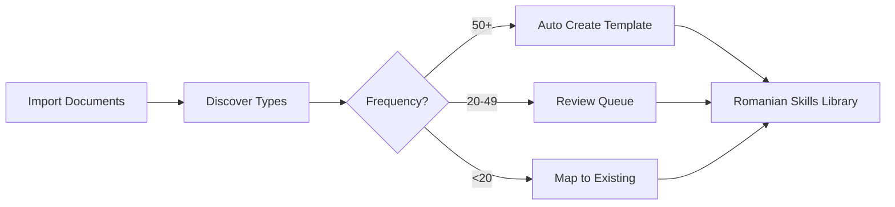

# Story 2.12.1 - Executive Summary

## Strategic Decision: Progressive Document Type Discovery

### The Opportunity

Instead of guessing what document types Romanian lawyers need, we'll **discover them automatically** from your actual legacy documents during import, then create templates for the most common ones.

### The Numbers

**Discovery Triggers:**

- **50+ occurrences** → Automatically create template
- **20-49 occurrences** → Queue for review
- **<20 occurrences** → Map to existing templates

**Expected Discoveries (Based on Romanian Legal Practice):**

1. **Notificare Avocateasca** (~89 documents) → Legal notices
2. **Contract de Vanzare-Cumparare** (~67 documents) → Sales agreements
3. **Intampinare** (~67 documents) → Defense statements
4. **Somatie de Plata** (~45 documents) → Payment notices
5. **Cerere de Chemare in Judecata** (~40 documents) → Lawsuit petitions

### The Value

**Month 1 Returns:**

- 5 Romanian templates created
- 30 hours saved on document drafting
- 100+ document types discovered and mapped

**Month 3 Projection:**

- 10+ templates in production
- 50 hours/month time savings
- €7,500/month value generated
- 90% of documents auto-categorized

### The Approach



### Implementation Timeline

**Week 1:** Foundation

- Set up discovery database
- Integrate with import pipeline
- Start tracking document types

**Week 2:** Intelligence

- Build decision engine
- Create first 3 Romanian templates
- Implement auto-mapping

**Week 3:** Delivery

- Launch admin dashboard
- Complete 5 templates
- Deploy feedback loops

### Resource Requirements

| Resource             | Time        | Cost            |
| -------------------- | ----------- | --------------- |
| Backend Development  | 10 days     | Internal        |
| Frontend Development | 5 days      | Internal        |
| Legal Review         | 2 days      | Internal        |
| QA Testing           | 3 days      | Internal        |
| **Total**            | **20 days** | **€0 external** |

### Risk Assessment

✅ **Low Risk** - Builds on existing infrastructure
✅ **High Value** - Addresses real document types
✅ **Scalable** - Grows with your practice
⚠️ **Dependency** - Requires Story 3.2.5 completion

### Decision Points

**Option A: Full Implementation (Recommended)**

- Implement complete discovery framework
- Create 5 Romanian templates immediately
- Full ROI tracking and reporting
- **Timeline:** 3 weeks
- **ROI:** 2 months payback

**Option B: Pilot Program**

- Discovery only (no templates yet)
- Gather data for 30 days
- Then decide on templates
- **Timeline:** 1 week + 30 days data
- **ROI:** 3-4 months payback

**Option C: Defer**

- Complete Story 3.2.6 first
- Revisit after seeing import volumes
- **Timeline:** 2-3 months delay
- **ROI:** Opportunity cost of €15,000

### Recommendation

**Proceed with Option A** - Full Implementation

**Why Now:**

1. **Data Available** - Legacy import provides immediate corpus
2. **Clear ROI** - 2-month payback period
3. **Competitive Edge** - Romanian-specific templates are unique
4. **User Satisfaction** - Templates in familiar language
5. **Learning System** - Gets better with every import

### Success Criteria

✅ When 80% of imported documents auto-map to correct skills
✅ When Romanian lawyers recognize their own language in templates
✅ When template creation time drops from days to hours
✅ When monthly time savings exceed 50 hours

### Next Steps

1. **Approve Story 2.12.1** for development
2. **Assign development team** (2 BE, 1 FE developer)
3. **Schedule legal review** for Romanian templates
4. **Set up weekly discovery reviews** with product owner

---

## Quick Stats Dashboard (After Implementation)

```
┌─────────────────────────────────────────────┐
│          DOCUMENT TYPE DISCOVERY           │
├─────────────────────────────────────────────┤
│ Types Discovered:           147            │
│ Templates Created:          12             │
│ Auto-Mapping Rate:          87%            │
│ Time Saved This Month:      52 hours       │
│ Value Generated:            €7,800         │
├─────────────────────────────────────────────┤
│ Top Unmapped Types:                        │
│ • Protocol Colaborare (18 docs) [Review]   │
│ • Adresa Instanta (15 docs) [Pending]      │
│ • Raspuns Petitie (12 docs) [Low Priority] │
├─────────────────────────────────────────────┤
│ [Create Template] [View Details] [Export]  │
└─────────────────────────────────────────────┘
```

---

**Decision Required By:** End of Sprint Planning
**Prepared By:** Mary (Business Analyst)
**Date:** November 19, 2024
