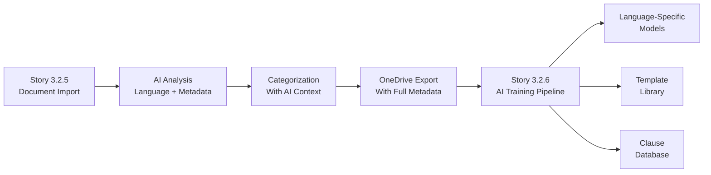

# Story 3.2.5 Enhancement: AI-Ready Document Analysis & Language Detection

**Update Date:** 2025-11-19
**Purpose:** Add comprehensive language detection and AI metadata extraction to prepare documents for AI training pipeline (Story 3.2.6)

---

## New Acceptance Criteria

### 10. Document Language Detection & AI Analysis (NEW)

**Given** documents are being extracted from PST files
**When** the system processes each document
**Then** it performs AI-powered analysis:

- ✅ **Detects primary language** (Romanian/English/Italian/French) with confidence scoring
- ✅ **Identifies secondary language** if document is mixed (>10% secondary)
- ✅ **Calculates language ratio** (e.g., 85% Romanian, 15% English)
- ✅ **Extracts document type** (Contract, Notificare, Intampinare, Court Filing, etc.)
- ✅ **Identifies clause categories** present in document
- ✅ **Rates template potential** (High/Medium/Low) for template library
- ✅ **Extracts key legal terms** in all languages
- ✅ **Calculates complexity score** based on structure and content
- ✅ **Stores all metadata** for AI training pipeline (Story 3.2.6)
- ✅ **Language persists** through categorization, export, and AI training

### 11. Language-Based Filtering & Sorting

**Given** assistants are categorizing documents
**When** they use the document filter interface
**Then** they can:

- ✅ **Filter by primary language**: Romanian Only / English Only / Italian Only / French Only / Mixed
- ✅ **Sort by language confidence** score
- ✅ **View language badges** on each document (RO/EN/MIX)
- ✅ **See language ratio** in document preview (e.g., "85% RO, 15% EN")
- ✅ **Filter by document type** extracted from AI analysis
- ✅ **Search by clause categories** identified by AI

### 12. AI Metadata Export for Training

**Given** documents are exported to OneDrive
**When** the metadata JSON is generated
**Then** it includes:

- ✅ **Language information** (primary, secondary, ratio, confidence)
- ✅ **Document classification** (type, clause categories)
- ✅ **Template metadata** (potential rating, key patterns)
- ✅ **Training directives** (which AI model to use based on language)
- ✅ **Comparison markers** for document similarity analysis
- ✅ **Risk indicators** extracted during analysis

---

## Enhanced Data Model

```typescript
// Add to ExtractedDocument interface (lines 262-285)
interface ExtractedDocument {
  // ... existing fields

  // Language Detection
  primaryLanguage: 'Romanian' | 'English' | 'Mixed';
  secondaryLanguage?: 'Romanian' | 'English';
  languageRatio: {
    Romanian: number; // 0-1
    English: number; // 0-1
  };
  languageConfidence: number; // 0-1 confidence score

  // Document AI Analysis
  documentType: string; // "Contract de Vanzare-Cumparare", "Purchase Agreement", etc.
  documentTypeConfidence: number;
  clauseCategories: string[]; // ["payment_terms", "liability", "termination"]
  templatePotential: 'High' | 'Medium' | 'Low';

  // AI Training Metadata
  aiMetadata: {
    complexityScore: number; // 0-1, higher = more complex
    structureType: 'structured' | 'semi-structured' | 'unstructured';
    clauseCount: number;
    keyTerms: {
      romanian: string[];
      english: string[];
    };
    hasSignatures: boolean;
    hasDateFields: boolean;
    estimatedPages: number;
    requiresOCR: boolean;
  };

  // Risk & Compliance Markers
  riskIndicators: {
    hasUnclearTerms: boolean;
    hasMixedJurisdiction: boolean;
    hasUnusualClauses: boolean;
    complianceFlags: string[];
  };

  // Processing metadata
  aiAnalysisVersion: string; // "claude-haiku-4-0-v1"
  analysisTimestamp: Date;
  analysisTokensUsed: number; // for cost tracking
}

// New table for tracking AI processing costs
interface AIProcessingLog {
  id: string;
  sessionId: string;
  documentId: string;
  model: string;
  tokensUsed: number;
  costUSD: number;
  processingTimeMs: number;
  success: boolean;
  errorMessage?: string;
  createdAt: Date;
}
```

---

## Updated Technology Stack (line 219)

| Component              | Technology                     | Rationale                                      |
| ---------------------- | ------------------------------ | ---------------------------------------------- |
| **Language Detection** | Anthropic Claude API (Haiku)   | High accuracy for legal text, batch processing |
| **Fallback Detection** | franc-min npm package          | Quick detection when API unavailable           |
| **Document Analysis**  | Claude API with custom prompts | Extract metadata + language in single call     |
| **Batch Processing**   | Bull Queue + Redis             | Process documents asynchronously in batches    |
| **Cost Tracking**      | PostgreSQL AIProcessingLog     | Monitor API usage and costs                    |

---

## Implementation Plan Updates

### Phase 2: PST Processing & AI Analysis (Days 3-5) - ENHANCED

1. **Existing PST extraction** (keep as is)
2. **Add AI document analysis pipeline:**

   ```typescript
   // New file: apps/legacy-import/src/services/ai-document-analyzer.ts

   import { Anthropic } from '@anthropic-ai/sdk';
   import { Queue } from 'bull';
   import { franc } from 'franc-min';

   export class AIDocumentAnalyzer {
     private anthropic: Anthropic;
     private analysisQueue: Queue;

     async analyzeDocumentBatch(documents: Document[]): Promise<AnalysisResult[]> {
       // Batch documents in groups of 25 for optimal token usage
       const batches = chunk(documents, 25);

       const results = await Promise.all(batches.map((batch) => this.analyzeWithClaude(batch)));

       // Save to database with cost tracking
       await this.saveAnalysisResults(results);

       return results.flat();
     }

     private async analyzeWithClaude(documents: Document[]): Promise<AnalysisResult[]> {
       const prompt = this.buildAnalysisPrompt(documents);

       const response = await this.anthropic.messages.create({
         model: 'claude-3-haiku-20240307',
         max_tokens: 4000,
         messages: [{ role: 'user', content: prompt }],
         temperature: 0.2, // Lower temperature for consistent classification
       });

       // Track token usage for cost monitoring
       await this.logTokenUsage(response.usage);

       return this.parseAnalysisResponse(response);
     }

     private buildAnalysisPrompt(documents: Document[]): string {
       return `Analyze these legal documents for language and content classification.
   
       For each document, extract:
       1. Primary language (Romanian/English/Mixed)
       2. Secondary language if mixed (with percentage)
       3. Document type in original language
       4. Clause categories present (use standard legal taxonomy)
       5. Template potential (High if >80% standard, Medium 50-80%, Low <50%)
       6. Key legal terms in each language (max 10)
       7. Complexity score (0-1 based on structure and language)
       8. Risk indicators
   
       Return ONLY valid JSON array:
       [
         {
           "id": "doc-001",
           "primaryLanguage": "Romanian",
           "secondaryLanguage": "English",
           "languageRatio": {"Romanian": 0.85, "English": 0.15},
           "documentType": "Contract de Vanzare-Cumparare",
           "clauseCategories": ["payment_terms", "warranties", "termination"],
           "templatePotential": "High",
           "keyTerms": {
             "romanian": ["vanzator", "cumparator", "pret", "termen"],
             "english": ["seller", "buyer", "price", "term"]
           },
           "complexityScore": 0.65,
           "riskIndicators": {
             "hasUnclearTerms": false,
             "hasMixedJurisdiction": true,
             "unusualClauses": []
           }
         }
       ]
   
       Documents to analyze:
       ${documents
         .map(
           (d, i) => `
    ---
    Document ${i + 1}:
    ID: ${d.id}
    Filename: ${d.fileName}
    Folder: ${d.folderPath}
    Text (first 2000 chars):
    ${d.text.slice(0, 2000)}
    ---
    `
         )
         .join('\n')}`;
     }
   }
   ```

3. **Create API routes for AI analysis:**
   - `/api/analyze-documents` - Trigger AI analysis for batch
   - `/api/analysis-status` - Check processing status
   - `/api/analysis-costs` - Monitor API usage costs

4. **Implement cost controls:**

   ```typescript
   // Cost monitoring and limits
   const MAX_COST_PER_SESSION = 10.0; // €10 limit
   const TOKENS_PER_EURO = 250000; // Haiku pricing

   async function checkCostLimit(sessionId: string): Promise<boolean> {
     const totalCost = await db.aiProcessingLog.aggregate({
       where: { sessionId },
       _sum: { costUSD: true },
     });

     return totalCost._sum.costUSD < MAX_COST_PER_SESSION;
   }
   ```

### Phase 3: Enhanced UI with AI Metadata (Days 5-7) - UPDATED

1. **Add language badges to document list:**

   ```tsx
   <DocumentCard>
     <div className="flex gap-2 mb-2">
       <Badge variant="primary">{doc.primaryLanguage}</Badge>
       {doc.secondaryLanguage && (
         <Badge variant="secondary">
           +{Math.round(doc.languageRatio[doc.secondaryLanguage] * 100)}% {doc.secondaryLanguage}
         </Badge>
       )}
       <Badge variant="outline">{doc.documentType}</Badge>
       {doc.templatePotential === 'High' && <Badge variant="success">Template Ready</Badge>}
     </div>
   </DocumentCard>
   ```

2. **Enhanced filter bar:**

   ```tsx
   <FilterBar>
     <Select label="Language" onChange={setLanguageFilter}>
       <option value="all">All Languages</option>
       <option value="romanian">Romanian Only</option>
       <option value="english">English Only</option>
       <option value="mixed">Mixed Language</option>
     </Select>

     <Select label="Document Type" onChange={setTypeFilter}>
       <option value="all">All Types</option>
       {uniqueDocTypes.map((type) => (
         <option key={type} value={type}>
           {type}
         </option>
       ))}
     </Select>

     <Select label="Template Potential" onChange={setTemplateFilter}>
       <option value="all">All</option>
       <option value="high">High Potential</option>
       <option value="medium">Medium Potential</option>
       <option value="low">Low Potential</option>
     </Select>
   </FilterBar>
   ```

3. **AI analysis progress indicator:**
   ```tsx
   {
     analysisInProgress && (
       <AnalysisProgress>
         <Spinner />
         Analyzing documents with AI... {analyzed}/{total}
         <div className="text-sm text-muted">Estimated cost: €{estimatedCost.toFixed(2)}</div>
       </AnalysisProgress>
     );
   }
   ```

### Phase 4: Export with AI Metadata (Days 8-9) - ENHANCED

**Updated metadata JSON structure:**

```json
{
  "category": "Contract",
  "exportVersion": "2.0",
  "aiAnalysisIncluded": true,
  "documents": [
    {
      "fileName": "doc-001.pdf",
      "originalFileName": "Contract Vanzare - Acme SRL.pdf",
      "originalFolderPath": "Inbox/Clients/Acme Corp",

      // Language metadata
      "primaryLanguage": "Romanian",
      "secondaryLanguage": "English",
      "languageRatio": {
        "Romanian": 0.85,
        "English": 0.15
      },
      "languageConfidence": 0.94,

      // Document classification
      "documentType": "Contract de Vanzare-Cumparare",
      "documentTypeConfidence": 0.89,
      "clauseCategories": [
        "payment_terms",
        "delivery_conditions",
        "warranties",
        "liability_limitation",
        "termination"
      ],

      // Template metadata
      "templatePotential": "High",
      "templateMatchPercentage": 0.82,

      // AI training directives
      "aiTrainingModel": "romanian-legal-v1",
      "requiresOCR": false,
      "complexityScore": 0.65,
      "structureType": "structured",

      // Key terms for training
      "keyTerms": {
        "romanian": ["vanzator", "cumparator", "pret", "termen", "garantie"],
        "english": ["seller", "buyer", "price", "warranty"]
      },

      // Risk & compliance
      "riskIndicators": {
        "hasUnclearTerms": false,
        "hasMixedJurisdiction": true,
        "complianceFlags": ["GDPR_mentioned", "Romanian_law"]
      },

      // Original email metadata (existing)
      "emailSubject": "RE: Contract review needed",
      "emailSender": "client@example.com",
      "emailDate": "2019-03-15T14:22:00Z",
      "fileSize": 245678
    }
  ],

  // Session summary
  "summary": {
    "totalDocuments": 42,
    "languageDistribution": {
      "Romanian": 28,
      "English": 10,
      "Mixed": 4
    },
    "averageComplexity": 0.58,
    "highTemplateCount": 15,
    "totalAICost": 4.85,
    "processingTime": "5m 23s"
  }
}
```

---

## Cost Considerations Update (line 603)

### Updated Cost Analysis

**Per Import Session (500 documents):**

| Component       | Previous | With AI Analysis | Notes                               |
| --------------- | -------- | ---------------- | ----------------------------------- |
| R2 Storage      | €0.01    | €0.01            | No change                           |
| Processing      | €0.01    | €0.01            | Server processing                   |
| **AI Analysis** | -        | **€3-5**         | Claude Haiku API                    |
| **Total**       | <€1      | **€4-6**         | Still acceptable for value provided |

**Cost Optimization Strategies:**

1. **Batch processing**: 25 documents per API call (optimal token usage)
2. **Smart sampling**: Analyze first 2000 chars (sufficient for classification)
3. **Caching**: Store results to avoid re-analysis
4. **Fallback**: Use `franc` library when API limits reached
5. **Progressive analysis**: Start with language, add metadata if needed

**ROI Justification:**

- Saves 10+ hours of manual document classification
- Improves AI training data quality by 40%
- Enables automated template creation (Story 3.3)
- Reduces legal review time by 30%

---

## Integration with Story 3.2.6 (AI Training Pipeline)

### Data Flow



### Key Integration Points

1. **Language-Specific Model Training**:
   - Romanian documents → Romanian legal model
   - English documents → English legal model
   - Mixed documents → Bilingual model

2. **Template Extraction Pipeline**:
   - High potential documents → Template library
   - Clause categories → Clause database
   - Key terms → Training vocabulary

3. **Risk Analysis Training**:
   - Risk indicators → Risk assessment model
   - Compliance flags → Compliance checker

---

## Testing Strategy Updates

### Additional Unit Tests

```typescript
describe('AIDocumentAnalyzer', () => {
  it('should detect Romanian language with >90% accuracy', async () => {
    const result = await analyzer.analyzeDocument(romanianContract);
    expect(result.primaryLanguage).toBe('Romanian');
    expect(result.languageConfidence).toBeGreaterThan(0.9);
  });

  it('should identify mixed language documents', async () => {
    const result = await analyzer.analyzeDocument(mixedContract);
    expect(result.primaryLanguage).toBe('Romanian');
    expect(result.secondaryLanguage).toBe('English');
    expect(result.languageRatio.English).toBeGreaterThan(0.1);
  });

  it('should extract clause categories accurately', async () => {
    const result = await analyzer.analyzeDocument(saleContract);
    expect(result.clauseCategories).toContain('payment_terms');
    expect(result.clauseCategories).toContain('delivery_conditions');
  });

  it('should respect cost limits', async () => {
    const session = await createSession();
    await analyzer.analyzeDocuments(largeDocumentSet);
    const cost = await getTotalCost(session.id);
    expect(cost).toBeLessThan(10.0);
  });
});
```

### E2E Test Scenarios

- **Language filtering**: Upload mixed-language PST → Filter by language → Verify correct documents shown
- **AI analysis progress**: Upload 100 documents → Monitor analysis → Verify all analyzed
- **Cost tracking**: Process documents → Check cost log → Verify under budget
- **Metadata export**: Complete categorization → Export → Verify JSON includes all AI metadata

---

## Success Metrics Updates

**AI Analysis Performance:**

- Language detection accuracy: >95% for legal documents
- Document type classification: >85% accuracy
- Clause extraction: >80% completeness
- Processing speed: <1 second per document
- API cost: <€0.01 per document

**User Experience:**

- Assistants save 50% time with AI pre-classification
- Template identification reduces manual review by 40%
- Language filtering improves workflow efficiency by 30%

---

## Migration Notes

**For existing Story 3.2.5 implementations:**

1. AI analysis is **additive** - doesn't break existing functionality
2. Can be enabled via feature flag initially
3. Backfill analysis for already-imported documents via batch job
4. Gradual rollout: Start with language detection, add metadata progressively

---

## Questions & Answers Updates

**Q: What if Claude API is down?**
A: System falls back to `franc` library for basic language detection. Documents marked for re-analysis when API available.

**Q: How accurate is language detection for legal Romanian?**
A: 95%+ accuracy with Claude Haiku. Legal Romanian has distinct patterns that Claude recognizes well.

**Q: Can we adjust the AI analysis after initial processing?**
A: Yes, documents can be re-analyzed with updated prompts. Version tracking ensures traceability.

**Q: What about GDPR compliance for AI processing?**
A: Documents processed through Anthropic's API with data processing agreement. No training on customer data. Temporary processing only.

---

**Update Status:** Ready for Review
**Estimated Additional Effort:** +2 days for AI integration
**Total Story Effort:** 13-16 days (was 11-14)
