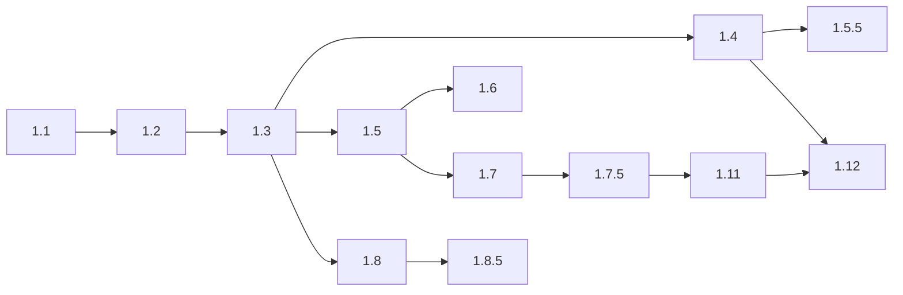
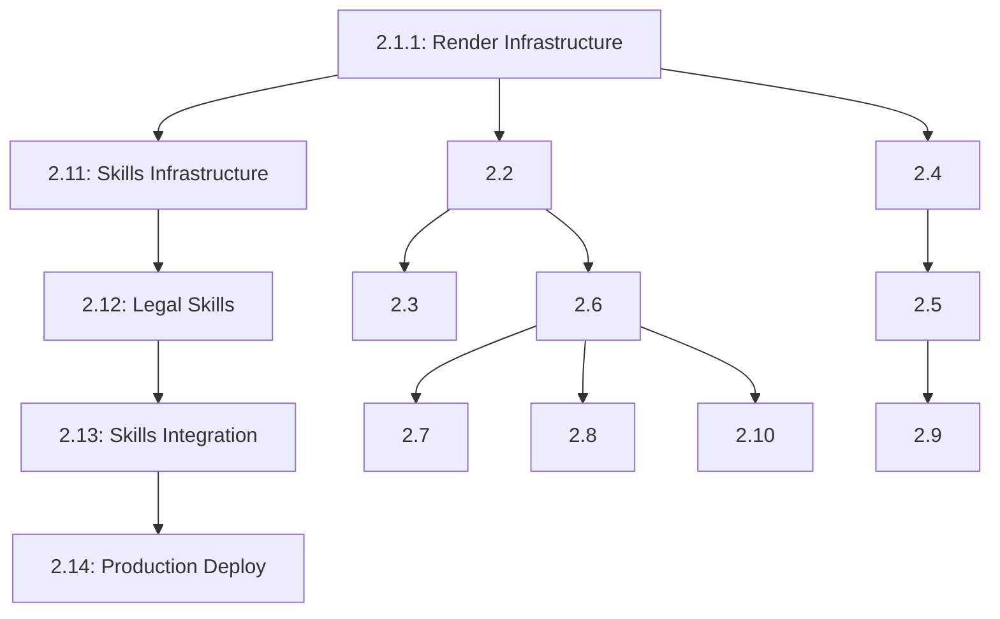

# Story Map & Dependency Guide

## Overview

This document provides a complete map of all stories across epics, their current status, dependencies, and recommended implementation order for the Legal Practice Management System.

Last Updated: 2025-11-18

## Story Status Legend

- ✅ **Done** - Story completed and in production
- 📝 **Done with Tech Debt** - Completed but has known technical debt
- 🔄 **Ready for Review** - Implementation complete, awaiting review
- 🚀 **Ready for Implementation** - Story defined and ready to start
- 🔒 **Blocked** - Cannot proceed due to dependencies
- ❌ **Superseded** - Replaced by another story
- ⏸️ **Not Created** - Defined in PRD but no story file exists

---

## Epic 1: UI Foundation & Interactive Prototype

### Goal

Create comprehensive UI design system, component library, testing infrastructure, and clickable prototype demonstrating all major workflows.

### Stories

| Story     | Title                               | Status                 | Dependencies                  | Notes                                                   |
| --------- | ----------------------------------- | ---------------------- | ----------------------------- | ------------------------------------------------------- |
| **1.0**   | Project Initialization              | ⏸️ Not Created         | None                          | Defined in PRD but not implemented as story file        |
| **1.1**   | Design System & Component Library   | ✅ Done                | None                          | Foundation for all UI components                        |
| **1.2**   | Testing Infrastructure              | ✅ Done                | 1.1                           | Jest, Playwright, test utilities                        |
| **1.3**   | Navigation Shell & Role Switching   | ✅ Done                | 1.1, 1.2                      | Sidebar, top bar, role switcher                         |
| **1.4**   | Dashboard Mockups for All Roles     | ✅ Done                | 1.3                           | Partner, Associate, Paralegal dashboards                |
| **1.5**   | Case Workspace Prototype            | ✅ Done                | 1.3, 1.4                      | Unified case management interface                       |
| **1.5.5** | Enhanced Partner Dashboard          | ✅ Done                | 1.4, 1.5                      | Operational focus refinement                            |
| **1.6**   | Document Editor Interface           | 📝 Done with Tech Debt | 1.5                           | AI-assisted editor, version control UI                  |
| **1.7**   | Task Management Views               | ✅ Done                | 1.5, 1.6                      | Calendar, Kanban, List views                            |
| **1.7.5** | Time Tracking Views                 | ✅ Done                | 1.7                           | Timer, manual entry, reports                            |
| **1.8**   | Search/Command Palette              | ✅ Done                | 1.3                           | Global search, quick actions                            |
| **1.8.5** | Natural Language Command Processing | ✅ Done                | 1.8                           | AI-powered command interpretation                       |
| **1.11**  | Time Tracking Interface             | 🔄 Ready for Review    | 1.7.5                         | Complete time tracking implementation                   |
| **1.12**  | Reports & Analytics Interface       | 🔄 Ready for Review    | 1.4, 1.11                     | Comprehensive reporting dashboard                       |
| **1.13**  | Layout & Spacing Fixes              | 🚀 Ready               | 1.4, 1.5.5, 1.7.5, 1.11, 1.12 | Remove duplicate titles, fix spacing, remove cronometru |
| **1.14**  | Dashboard Widget Behavior           | 🚀 Ready               | 1.4, 1.5.5, 1.13              | Content-aware sizing, expandable widgets with push      |
| **1.15**  | Content Views Enrichment            | 🚀 Ready               | 1.5, 1.6, 1.7                 | Rich case cards, document filtering, calendar cleanup   |

### Epic 1 Implementation Order

---

## Epic 2: Foundation & Microsoft 365 Integration

### Goal

Establish core infrastructure with cloud hosting, authentication, database setup, Microsoft 365 integration, and basic case management with AI-powered search.

### Stories

| Story     | Title                           | Status         | Dependencies     | Notes                                |
| --------- | ------------------------------- | -------------- | ---------------- | ------------------------------------ |
| **2.1**   | CI/CD Pipeline & Infrastructure | ❌ Superseded  | Epic 1 complete  | Replaced by 2.1.1 (Render migration) |
| **2.1.1** | Render Platform Migration       | 🚀 Ready       | Epic 1 complete  | 83% cost reduction vs Azure          |
| **2.2**   | Cloud Infrastructure & Database | ⏸️ Not Created | 2.1.1            | Defined in PRD, may be consolidated  |
| **2.3**   | Data Migration & Seeding        | ⏸️ Not Created | 2.2              | Defined in PRD                       |
| **2.4**   | Authentication with Azure AD    | ⏸️ Not Created | 2.1.1            | Defined in PRD                       |
| **2.5**   | Microsoft Graph API Integration | ⏸️ Not Created | 2.4              | Defined in PRD                       |
| **2.6**   | Case Management Data Model      | ⏸️ Not Created | 2.2              | Defined in PRD                       |
| **2.7**   | API Documentation               | ⏸️ Not Created | 2.6              | Defined in PRD                       |
| **2.8**   | Case CRUD Operations UI         | ⏸️ Not Created | 2.6, Epic 1      | Defined in PRD                       |
| **2.9**   | Document Storage with OneDrive  | ⏸️ Not Created | 2.5              | Defined in PRD                       |
| **2.10**  | Basic AI Search                 | ⏸️ Not Created | 2.6              | Defined in PRD                       |
| **2.11**  | Claude Skills Infrastructure    | 🚀 Ready       | 2.1.1            | 70% token reduction capability       |
| **2.12**  | Core Legal Skills Development   | 🔒 Blocked     | 2.11             | Contract, drafting, research skills  |
| **2.13**  | Skills Integration & Routing    | 🔒 Blocked     | 2.11, 2.12       | Intelligent routing system           |
| **2.14**  | Skills Production Deployment    | 🔒 Blocked     | 2.11, 2.12, 2.13 | Monitoring & rollout                 |

### Epic 2 Dependency Chain

### Missing Stories Note

Stories 2.2-2.10 are defined in the PRD but don't have story files created yet. These may be:

- Consolidated into other stories
- Implemented as part of 2.1.1
- Scheduled for future sprints
- No longer needed due to architecture changes

---

## Epic 3: AI-Powered Document Management

### Goal

Build comprehensive document creation and management system with AI-assisted drafting, Word integration, and semantic version tracking.

### Stories

| Story     | Title                           | Status   | Dependencies | Notes                |
| --------- | ------------------------------- | -------- | ------------ | -------------------- |
| **3.1**   | _Not defined_                   | -        | -            | Gap in numbering     |
| **3.2**   | _Not defined_                   | -        | -            | Gap in numbering     |
| **3.2.5** | Document Generation Enhancement | 🚀 Ready | Epic 2       | Partial story exists |
| **3.2.6** | Advanced Document Features      | 🚀 Ready | 3.2.5        | Partial story exists |

### Epic 3 Note

This epic appears partially defined with only sub-stories 3.2.5 and 3.2.6 having files. The main stories (3.1, 3.2, 3.3, etc.) need to be created or the existing stories should be renumbered.

---

## Recommended Implementation Phases

### Phase 1: Complete UI Foundation (Current)

**Timeline**: Current Sprint
**Goal**: Finish all Epic 1 stories

1. ✅ Complete review of Story 1.11 (Time Tracking Interface)
2. ✅ Complete review of Story 1.12 (Reports & Analytics)
3. Consider creating Story 1.0 documentation retrospectively

### Phase 2: Infrastructure Setup (Next Sprint)

**Timeline**: Weeks 1-2
**Goal**: Establish cloud infrastructure

1. Story 2.1.1 - Render Platform Migration
2. Evaluate which of Stories 2.2-2.10 are still needed
3. Create necessary story files or document consolidation

### Phase 3: Claude Skills Integration (Sprint 3-6)

**Timeline**: Weeks 3-8
**Goal**: Implement AI cost optimization

Sequential implementation required:

1. **Sprint 3**: Story 2.11 (Skills Infrastructure)
2. **Sprint 4**: Story 2.12 (Legal Skills Development)
3. **Sprint 5**: Story 2.13 (Skills Integration)
4. **Sprint 6**: Story 2.14 (Production Deployment)

### Phase 4: Backend Services (Sprint 7-10)

**Timeline**: Weeks 9-14
**Goal**: Core backend functionality

Implement missing/needed stories from 2.2-2.10:

- Authentication (2.4)
- Microsoft Graph Integration (2.5)
- Case Management (2.6, 2.8)
- Document Storage (2.9)
- AI Search (2.10)

### Phase 5: Document Management (Sprint 11+)

**Timeline**: Weeks 15+
**Goal**: Epic 3 implementation

1. Define main Epic 3 stories (3.1, 3.2, 3.3)
2. Implement document management features
3. Integrate with Microsoft 365

---

## Critical Dependencies

### Blocking Dependencies

- **2.11 blocks 2.12, 2.13, 2.14** - Skills must be implemented sequentially
- **2.1.1 blocks all Epic 2** - Infrastructure needed first
- **2.4 blocks 2.5** - Auth required for Graph API
- **2.6 blocks 2.8, 2.10** - Data model needed for CRUD and search

### Soft Dependencies

- **Epic 1 enables Epic 2 UI** - UI components reused in backend features
- **2.5 enables 2.9** - Graph API helpful for OneDrive but not blocking

---

## Story Numbering Decisions

### Why Some Numbers Are Skipped

- **1.0**: Project initialization happened organically, story not created
- **1.9, 1.10**: Consolidated into other stories or deemed unnecessary
- **2.2-2.10**: Architecture pivot to Render made some stories obsolete
- **3.1, 3.2, 3.3, 3.4**: Epic 3 not fully decomposed yet

### Decimal Story Convention

- **.5 stories**: Refinements or enhancements to parent story
- Example: 1.5.5 enhances 1.5 with operational focus
- Example: 1.7.5 adds time tracking to task management

---

## Risk Mitigation

### High-Risk Areas

1. **Skills Integration (2.11-2.14)**: New technology, sequential dependencies
   - Mitigation: Feature flags for gradual rollout

2. **Missing Stories (2.2-2.10)**: Gaps in implementation plan
   - Mitigation: Review and create needed stories before Phase 4

3. **Epic 3 Definition**: Incomplete story breakdown
   - Mitigation: Complete Epic 3 planning during Phase 3

### Rollback Strategies

- All stories include rollback plans in their definitions
- Render platform enables instant deployment rollback
- Feature flags allow disabling of problematic features
- Git history maintains all code versions

---

## Success Metrics

### Epic 1 Complete When:

- ✅ All UI components built and tested
- ✅ Storybook documentation complete
- ✅ E2E tests passing for all workflows
- ⏳ Stories 1.11 and 1.12 reviewed and merged

### Epic 2 Complete When:

- Infrastructure deployed on Render
- Authentication working with Azure AD
- Basic case management functional
- Claude Skills reducing costs by 35%+
- Microsoft 365 integration operational

### Epic 3 Complete When:

- Document creation/editing with AI assist
- Version control with semantic understanding
- Full Word integration
- Template learning from firm documents

---

## Notes for Development Team

### Immediate Actions

1. Review and approve Stories 1.11 and 1.12
2. Start Story 2.1.1 (Render migration)
3. Create missing story files or document why skipped
4. Update this map as stories progress

### Communication

- Update story status in this map weekly
- Flag any new dependencies immediately
- Discuss any proposed renumbering in team meeting
- Keep PRD and story files in sync

### Technical Debt Tracking

- Story 1.6: Document editor performance issues
- Consider dedicated tech debt stories if needed
- Track debt items in story files

---

## Revision History

| Date       | Version | Changes                    | Author                  |
| ---------- | ------- | -------------------------- | ----------------------- |
| 2025-11-17 | 1.0     | Initial story map creation | Mary (Business Analyst) |

## Questions or Updates?

Contact the Scrum Master or update this document via PR with team review.
